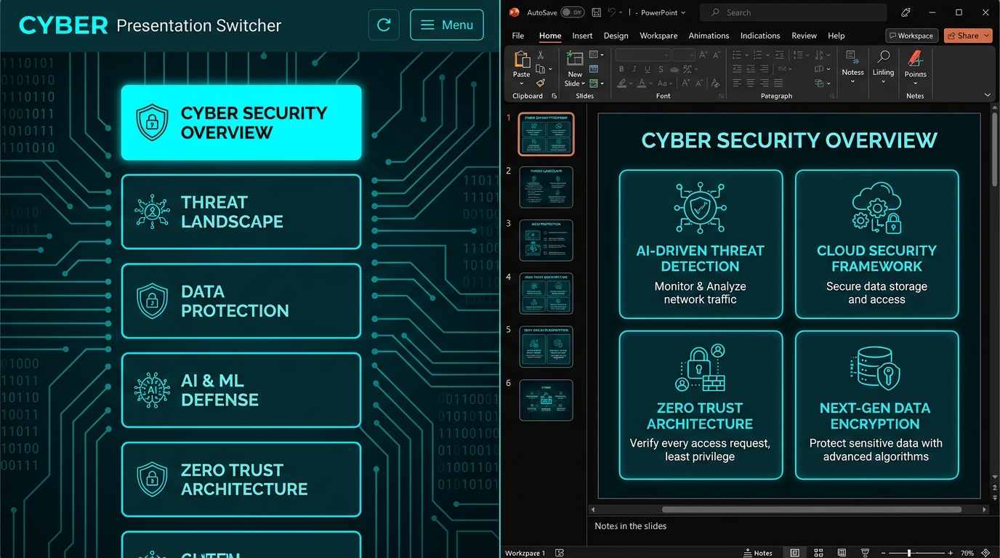
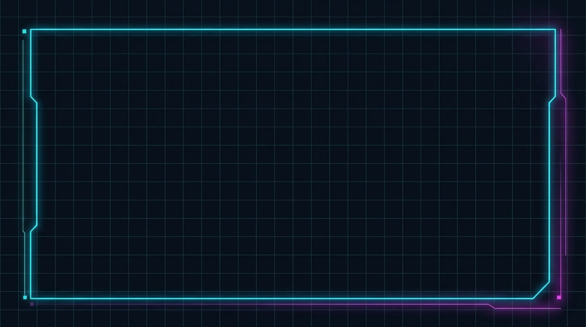
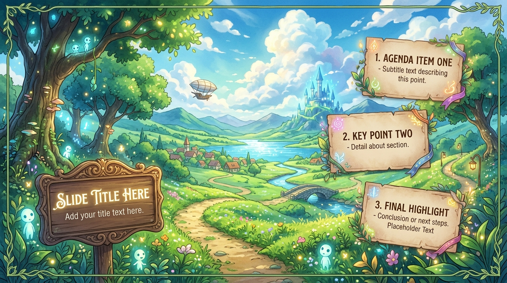
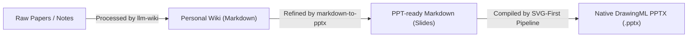

# Markdown to PPTX 📊

Convert Markdown documents directly into native, editable, and beautifully styled PowerPoint (`.pptx`) presentations.

This repository provides a dual-engine converter designed to generate professional, presentation-ready slides:
1. **Python Engine (`python-pptx`)**: Perfect for strict adherence to custom corporate master templates.
2. **JS Web Engine with AIGC Dynamic Synthesis (SVG-First & DrawingML Compiler)**: Our premium design engine. It extracts the visual DNA of any style mockup, dynamically synthesizes responsive layouts (preventing text overflow through coordinate reflow), and compiles SVGs into **native, fully editable DrawingML shapes** via our `ppt-master` submodule integration.

---

## 🎨 Visual Theme & Layout Previews

### 1. Concept Design vs. Actual Generated PPTX & HTML Previews:
*   **Design Concept Mockup (Generated via AIGC)**:
    
*   **Actual Generated PPT and HTML Effect (Dynamic Canvas Rendering)**:
    
    

### 2. AIGC Dynamic Theme Demos (Theme: Cyberpunk HUD & Ghibli Watercolor):
| | **Cyberpunk HUD** | **Ghibli Watercolor** |
|:---|:---:|:---:|
| **Concept Mockup** |  |  |
| **Generated Effect** |  |  |
| *Style* | Asymmetric glowing neon terminal HUD | Soft parchment cards on top of anime sky backgrounds |

---

## 🔄 Integration Workflow: From Personal-Wiki to PowerPoint

This skill works as an essential downstream component of the [Personal-Wiki](https://github.com/arvrschool/Personal-Wiki) ecosystem:



1. **Information Structuring (via `llm-wiki`)**: Processes raw research papers or documentation into structured Markdown wiki pages.
2. **Slide Refinement**: The `markdown-to-pptx` skill parses the wiki documents, cleans custom Obsidian syntaxes, and structures them into slide outlines separated by `---` rules.
3. **PowerPoint Compilation**: Our Node.js and Python toolchain compiles them into editable PowerPoint files.

---

## 🌟 Key Features

* **Dual-Engine Flex**: Use Python for standard master templates, or Node.js + Python DrawingML for state-of-the-art AIGC styled decks.
* **AIGC Dynamic Synthesis (SVG-First)**:
  * **Visual DNA Extraction (`extract_visual_dna.js`)**: Analyzes sample templates to extract primary colors, fonts, card corner radii, and decorative element rules.
  * **Gradient backdrop generation (`generate_gradient.js`)**: Programmatically renders smooth background gradients to avoid blurry template image backgrounds.
  * **Editable DrawingML Compiling (`svg_to_dml.js` / `ppt-master` submodule)**: Translates layout SVGs (rects, lines, text boxes, and paths) into editable PowerPoint shapes. Text boxes stay 100% editable inside MS PowerPoint.
* **Anti-Duplication Blueprint Gate**:
  * Step 4 enforces a **Global Layout Blueprint Declaration and Self-Check** before generating coordinates.
  * **Repetition Limits**: Maximum 2 duplicates of any layout structure per deck, and never adjacent.
  * **Collision Checking**: If card bounds overlap >85% compared to prior slides, it forces an asymmetrical layout redesign (breaking visual monotony).
* **Responsive Layout Components**: Automatically fits text density and structures into:
  * **Centered Breathe**: Large central card for focus.
  * **Horizontal Grid Cards**: 2 to 3 side-by-side card grids.
  * **2x2 Matrix Grid**: Balanced dashboard for comparative metrics.
  * **Timeline/Sequence**: Chronological connected process chains.
  * **Asymmetric Columns**: Splitting text and graphics with custom offsets and margins.

---

## 🚀 Installation & Setup

### 1. Initialize Submodule (Required for Dynamic JS Engine)
To compile SVG structures into native PowerPoint DrawingML shapes, this repository relies on the `ppt-master` compiler as a submodule. Initialize it using:
```bash
git submodule update --init --recursive --depth 1
```

### 2. Engine Dependencies
* **Python Engine**: Install `python-pptx`:
  ```bash
  pip install python-pptx
  ```
* **JS Engine**: Install packages inside the `scripts` directory:
  ```bash
  cd scripts
  npm install
  ```

---

## 💻 Usage Guide

### Option A: Python Engine (Template-driven)
Best for corporate decks that require strict alignment to an existing `.pptx` template.
```bash
python scripts/md2pptx.py input.md -t corporate_template.pptx -o output.pptx
```

### Option B: JS Web Engine (Dynamic Cards & Submodule DrawingML compiler)
Best for technical slides, academic papers, and highly styled presentations.

**Standard Conversion (Generates the `.pptx` slide deck plus a responsive HTML switcher preview):**
```bash
node scripts/md2pptx_web.js input.md -o output.pptx -t <theme>
```
*Available precompiled themes:* `light`, `dark`, `warm`, `aurora`, `forest`, `ocean`, `spatial`, `cyberpunk`, `holodeck`, `ghibli`.

**To compile with custom Visual DNA extraction:**
1. Extract design tokens from a style mockup:
   ```bash
   node scripts/extract_visual_dna.js design_mockup.png <theme_name> ./
   ```
2. Generate background backdrops from the extracted DNA:
   ```bash
   node scripts/generate_gradient.js <theme_name> ./ ./assets/
   ```
3. Run the compiler:
   ```bash
   node scripts/md2pptx_web.js input.md -o output.pptx -t <theme_name>
   ```

---

## 📐 Layout Component Specification

| Layout Component | Trigger Condition | Visual Style |
| :--- | :--- | :--- |
| **Centered Breathe** | Text < 120 chars, no images. | Single central card, +4pt font size, high margins. |
| **Horizontal Grid Cards** | 2-3 bullet items. | Dynamic horizontal cards with thin borders & headers. |
| **2x2 Matrix Grid** | Exactly 4 bullet items. | 2x2 card matrix with icons on the left, details on the right. |
| **Timeline/Sequence** | 3-5 items starting with numbers (e.g. `1. **Step**`). | Chronological timeline nodes connected by paths. |
| **Asymmetric Split** | Standard text + at least one image. | Left-aligned text card, right-aligned image card with custom offsets. |

---

## 🤖 Antigravity Custom Skill Integration

If you use **Google Antigravity**, you can load this repository as an autonomous custom skill:

1. **Global Installation**:
   Copy the `markdown-to-pptx` directory into your global customizations root:
   * Windows: `C:\Users\<Username>\.gemini\skills\markdown-to-pptx`
   * Linux/macOS: `~/.gemini/config/skills/markdown-to-pptx`

2. **Project-Scoped Installation**:
   Place it in the workspace folder under `.agents/skills/markdown-to-pptx`.

Once active, the Antigravity agent will automatically invoke the skill whenever you ask it to generate presentations, triggering an interactive selection modal to confirm your engine, richness, and theme preferences.

---

## 📄 License
This project is licensed under the MIT License.
