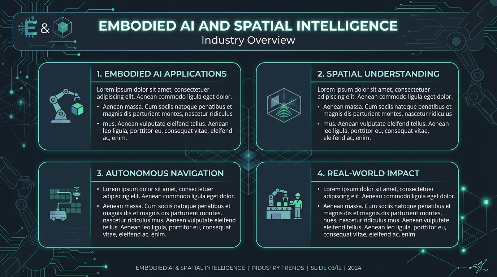
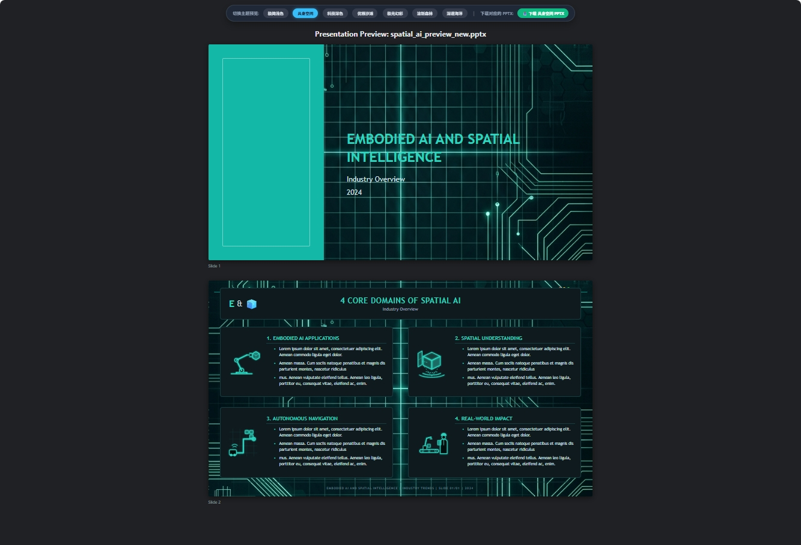
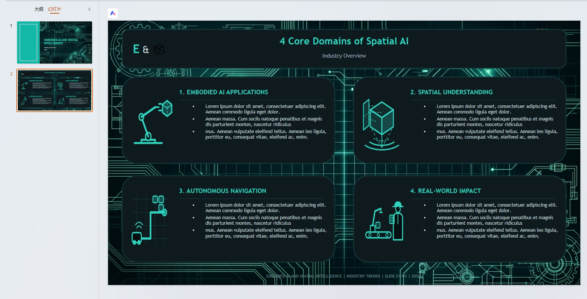
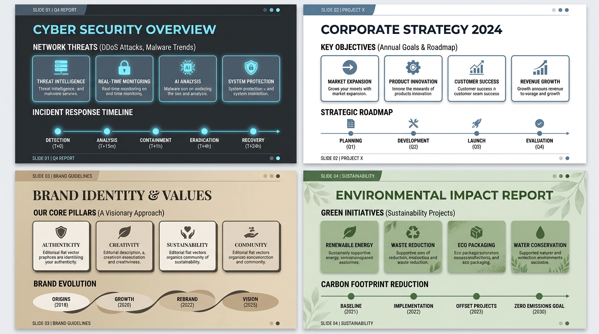
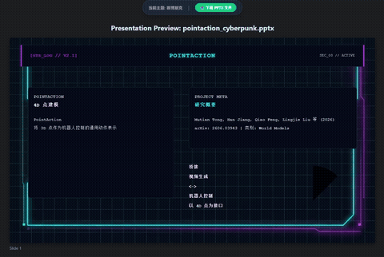
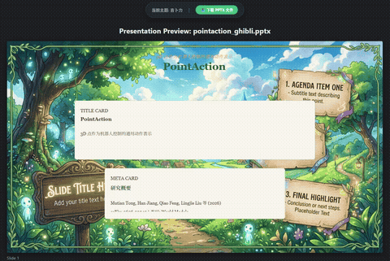
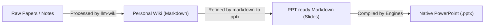
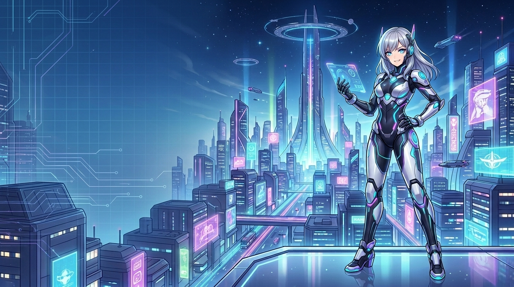

# Markdown to PPTX 📊

Convert Markdown documents directly into native, editable, and beautifully styled PowerPoint (`.pptx`) presentations. 

This repository provides a dual-engine converter designed to generate professional, presentation-ready slides:
1. **Python Engine (`python-pptx`)**: Perfect for strict adherence to custom corporate master templates.
2. **JS Web Engine (`pptxgenjs` in Node.js)**: Ideal for high-density content, featuring **dynamic font scaling** to prevent text overflows and an **automatic component layout system**.

It is also fully compatible as a **Google Antigravity Custom Skill**, enabling your AI coding assistant to generate slides directly inside your workspace chat.

### 🎨 Visual Theme & Layout Previews

#### 1. Concept Design vs. Actual Generated PPTX & HTML Previews:
*   **Design Concept Mockup (Generated via AIGC)**:
    
*   **Actual Generated PPT and HTML Effect**:
    
    

#### 2. Precompiled Global Themes (Minimalist Light, Cyber Dark, Warm Editorial, Sage Forest, etc.):


#### 3. AIGC Dynamic Theme Demos (Cyberpunk · Ghibli Anime):
| Cyberpunk HUD Terminal | Ghibli Watercolor Anime |
|:---:|:---:|
|  |  |
| *High-density asymmetric neon HUD cards* | *Hand-drawn parchment cards on meadow scenery* |

---

## 🔄 Integration Workflow: From Personal-Wiki to PowerPoint

This skill works as an essential downstream component of the [Personal-Wiki](https://github.com/arvrschool/Personal-Wiki) ecosystem:



1. **Information Structuring (via `llm-wiki`)**:
   First, raw research papers, documentation, or study notes are processed using the [llm-wiki](https://github.com/arvrschool/Personal-Wiki) skill to generate structured Markdown wiki pages or progressive QA databases.
2. **Slide Refinement**:
   The `markdown-to-pptx` skill acts as a downstream pipeline processor. It reads the dense, information-rich Wiki documents, filters out Obsidian-specific syntax (like double-brackets or raw callouts), and refines them into a slide-friendly Markdown outline using `---` slide separators, H2 titles, and layout-triggering list formats.
3. **PowerPoint Compilation**:
   The Python or JS engines compile the refined presentation outline into a native, high-quality `.pptx` file.

---

## 🌟 Key Features

* **Dual-Engine Flexibility**: Use Python for standard templates or Node.js for advanced web-inspired card layouts.
* **Dynamic Font Scaling (JS Engine)**: Autodetects text volume and reduces font size to fit boxes when text density is high.
* **Component-Based Slide Layouts**: Automatically switches layout based on Markdown patterns:
  - **Centered Breathe**: Large centered text for key quotes or single takeaways.
  - **Horizontal Grid Cards**: Aligns bullet points horizontally as stylish, border-bordered cards.
  - **Timeline/Sequence**: Renders numbered steps as a chronological sequence chain.
  - **Asymmetric Split**: Splits slides into text columns and image columns with safe margins.
* **Multi-Theme Support (JS Engine)**: Includes 10 curated color palettes (Minimalist Light, Cyber Dark, Cyberpunk, Warm Editorial, Aurora Purple, Sage Forest, Deep Ocean, Spatial AI, Holodeck, Ghibli Anime).
* **Speaker Notes**: Extracts `<!-- notes: ... -->` comments from Markdown directly into PowerPoint speaker notes.
* **Image Auto-Fitting**: Detects images in Markdown syntax (``) and aligns them dynamically.

---

## 🚀 Installation & Setup

### 1. Python Engine Dependencies
Ensure you have Python 3 installed, then install the required `python-pptx` library:
```bash
pip install python-pptx
```

### 2. JS Web Engine Dependencies
Navigate to the `scripts` directory and install the Node.js packages:
```bash
cd scripts
npm install
```
*(Requires Node.js v14+)*

---

## 💻 Usage Guide

### Option A: Python Engine (Template-driven)
Best for corporate decks that require strict alignment to an existing `.pptx` template.

**Standard Conversion:**
```bash
python scripts/md2pptx.py input.md -o output.pptx
```

**Using a Corporate Slide Template:**
```bash
python scripts/md2pptx.py input.md -t corporate_template.pptx -o output.pptx
```

---

### Option B: JS Web Engine (Dynamic Cards & Themes)
Best for academic paper reviews, technical presentations, and complex layout structures.

**Standard Conversion (Generates all 10 themes with an HTML switcher):**
```bash
node scripts/md2pptx_web.js input.md -o output.pptx -t all
```

**Using a Specific Theme:**
```bash
node scripts/md2pptx_web.js input.md -o output.pptx -t <theme>
```
*Available themes:* `light`, `dark`, `warm`, `aurora`, `forest`, `ocean`, `spatial`, `cyberpunk`, `holodeck`, `ghibli`.

---

## 🔄 Paradigm Shift in Presentation Generation

Traditional markdown-to-PPTX tools and AI templates operate on a **Static Template Paradigm**. This repository introduces a **Dynamic Synthesis Paradigm** tailored for the AI-agent era:

| Feature / Dimension | Static Template Paradigm (Python Engine) | Dynamic Synthesis Paradigm (JS Web Engine) |
| :--- | :--- | :--- |
| **Design Source** | Static `.pptx` slides (Slide Masters). | **AIGC Image Concept Mockups (e.g., Midjourney).** |
| **Translation** | Hardcoded text filling into static boxes. | **AI visual coordinate parsing (JSON Layouts) ➔ Code Compilation.** |
| **Responsiveness** | **Rigid**. Does not adapt to content volume. | **Dynamic**. Layout adapts at runtime (2x2 Matrix, Timelines, Auto-Fit). |
| **Best Used For** | Corporate slide decks with strict design policies. | High-density technical papers, agile reviews, AI-agent pipelines. |

By moving design templates from static PPT files to **AIGC Image Design Coordinates ➔ Dynamic Code Rendering**, we solve the age-old problem of text overflows in AI-generated presentations, yielding elastic layouts that balance themselves according to the slide structure.

### 📐 Case Study: AIGC Layered Vector Generation (Theme: `spatial`)

Rather than inserting flat, noisy bitmap screenshots into slide cards (which causes background mismatch and JPEG compression blur), the Dynamic Synthesis Paradigm compiles the slide by layering clean, transparent vector assets over an AI-generated high-res background:

*   **1. AI-Generated Background (`spatial_bg.jpg`)**:
    
*   **2. Recreated Pure Vector Icons (`.svg` format with glowing drop-shadows)**:
    *   **Card 1 (Robotic Arm)**: `assets/spatial_icon_1.svg`
    *   **Card 2 (3D Projection Cube)**: `assets/spatial_icon_2.svg`
    *   **Card 3 (Radar Navigation Grid)**: `assets/spatial_icon_3.svg`
    *   **Card 4 (Conveyor & Worker)**: `assets/spatial_icon_4.svg`

This layered compilation guarantees **perfect transparency**, **zero color borders/bleeding**, and **infinite vector scaling** of illustrations inside native PowerPoint slides.

---

## 📐 Layout Component System

The JS Web Engine analyzes the text density and structure of each slide and applies one of the following layouts:

| Layout Component | Trigger Condition | Visual Style |
| :--- | :--- | :--- |
| **Centered Breathe** | Text < 120 chars, no images, no cards. | Single central card, +4pt font size, high margins. |
| **Horizontal Grid Cards** | 2-3 items formatted as `- **Title**: Body` | Dynamic horizontal card grid with thin borders & accent headers. |
| **2x2 Matrix Grid** | Exactly 4 items formatted as `- **Title**: Body` | 2x2 card matrix. Left side of card displays semantic icon; right side displays title + body. |
| **Timeline/Sequence** | 3-5 items starting with numbers (e.g., `1. **Step**`) | Dashed timeline path with accent markers and description columns below. |
| **Asymmetric Split** | Standard text + at least one image. | Left-aligned text card, right-aligned centered image card with safe 5% margins. |

---

## 📝 Markdown Format Specification & Manual Tweaks

This section serves as the target output format for automated generators (like `llm-wiki`) to compile slides correctly, as well as a reference guide for manual customization and overrides.

To format the Markdown for perfect conversion, follow this structure:

```markdown
# WAM4D: Spatial Register Tokens
Advanced World Action Models
Google DeepMind Team

---

## Centered Breathe Example
This is a single central idea or quote. Because it has very few characters, it triggers the Centered Breathe layout automatically.

---

## Technical Accomplishments
- **Multi-Task Superhuman**: Beats expert baseline in 12 spatial geometry tests.
- **3D Spatial Emergence**: Generates consistent structures without 3D labels.
- **Zero-Shot Adaptation**: Directly fits unseen simulation environments.

---

## Timeline Step Layout
1. **Define Model**: Build spatial registers and position embeddings.
2. **Spatiotemporal Fusion**: Mix contextual representations via self-attention.
3. **Decode & Reconstruct**: Project results back to output 4D action space.

---

## Architecture Overview
- **Dual-Channel Fusion**: Texts are parsed on the left side card.
- **Visual Compensation**: Images auto-align on the right with a dynamic caption panel.


<!-- notes: Mention that spatial register tokens are updated dynamically at 30Hz. -->
```

---

## 🤖 Antigravity Custom Skill Integration

If you use **Google Antigravity**, you can load this repository as an autonomous custom skill:

1. **Global Installation**:
   Copy the `markdown-to-pptx` directory into your global customizations root:
   * Windows: `C:\Users\<Username>\.gemini\skills\markdown-to-pptx`
   * Linux/macOS: `~/.gemini/config/skills/markdown-to-pptx`

2. **Project-Scoped Installation**:
   Place it in the workspace folder under `.agents/skills/markdown-to-pptx`.

Once active, the Antigravity agent will automatically invoke the skill whenever you ask it to generate presentations, triggering an interactive selection modal to confirm your engine, richness, and theme preferences.

---

## 📄 License
This project is licensed under the MIT License.
