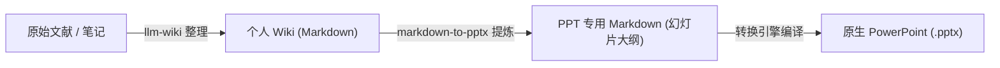

# Markdown to PPTX 📊

将 Markdown 文档直接转换为原生、可编辑且设计精美的 PowerPoint (`.pptx`) 演示文稿。

本仓库提供了一个双引擎转换器，旨在生成专业、演示就绪的幻灯片：
1. **Python 引擎 (`python-pptx`)**：非常适合严格遵循自定义企业母版模板的场景。
2. **JS Web 引擎 (Node.js 中的 `pptxgenjs`)**：适用于高密度内容，具有**动态字体缩放**功能以防止文本溢出，并配有**自动组件布局系统**。

它还完全兼容 **Google Antigravity 自定义技能 (Custom Skill)**，使您的 AI 编程助手能直接在工作区聊天中生成幻灯片。

### 🎨 视觉主题与版式预览

#### 1. 概念设计效果图 vs. 实际生成的 PPT 与 HTML 预览效果对比：
*   **设计概念效果图 (AIGC 生成)**：
    
*   **实际生成的PPT和HTML效果图**：
    
    

#### 2. 其他预置全局主题效果（极简浅色、科技深色、优雅沙滩、清新森林等）：


#### 3. AIGC 动态主题演示 (赛博朋克 · 吉卜力动漫)：
| 赛博朋克 HUD 终端 | 吉卜力水彩动漫 |
|:---:|:---:|
|  |  |
| *高密度不对称霓虹 HUD 卡片* | *手绘水彩羊皮纸卡片·草地蓝天背景* |

---

## 🔄 集成工作流：从 Personal-Wiki 到 PPT 演示文稿

该技能被设计为 [Personal-Wiki](https://github.com/arvrschool/Personal-Wiki) 知识库生态系统中的下游重要组件：



1. **信息整理与结构化 (使用 `llm-wiki`)**：
   首先，原始学术论文、技术文档或学习笔记通过 [llm-wiki](https://github.com/arvrschool/Personal-Wiki) 技能进行处理，提取并生成结构化的 Markdown 知识库页面或四级认知维度的 QA 数据库。
2. **幻灯片大纲提炼**：
   `markdown-to-pptx` 技能作为工作流的下游管道。它读取高密度的 Wiki 文档，过滤掉 Obsidian 的私有扩展语法（如双链、自定义 Callout 等），并提炼出契合 PPT 演示逻辑的精炼版 Markdown 大纲（包含 `---` 分页符、H2 标题，以及能触发特定卡片布局的列表语法）。
3. **PPTX 编译输出**：
   使用 Python 引擎或 JS 引擎将提炼后的 PPT 专用大纲一键转换为最终的原生 `.pptx` 演示文稿。

---

## 🌟 核心特性

* **双引擎灵活性**：对于标准模板使用 Python，对于高级 Web 风格的卡片布局使用 Node.js。
* **动态字体缩放 (JS 引擎)**：自动检测文本量，并在文本密度较高时自动缩小字体以适应文本框。
* **基于组件的幻灯片布局**：根据 Markdown 结构自动切换布局形式：
  - **Centered Breathe (居中呼吸)**：为关键名言或单一结论提供大字号居中卡片布局。
  - **Horizontal Grid Cards (水平栅格卡片)**：将无序列表水平排列为精美的微立体边框卡片。
  - **Timeline/Sequence (时间轴/步骤链)**：将带序号的步骤渲染为带节点的时序链条。
  - **Asymmetric Split (非对称双栏)**：将幻灯片拆分为文本卡片与图片卡片，预留 5% 安全边距防溢出。
* **多主题支持 (JS 引擎)**：内置 10 种精心调配的色彩搭配（Minimalist Light、Cyber Dark、Cyberpunk、Warm Editorial、Aurora Purple、Sage Forest、Deep Ocean、Spatial AI、Holodeck、Ghibli 吉卜力动漫）。
* **演讲者备注**：提取 Markdown 中的 `<!-- notes: ... -->` 注释直接写入 PowerPoint 备注栏。
* **图片自动适配**：解析 Markdown 图片语法 (``) 并进行动态重心对齐。

---

## 🚀 安装与设置

### 1. Python 引擎依赖
请确保已安装 Python 3，然后安装所需的 `python-pptx` 库：
```bash
pip install python-pptx
```

### 2. JS Web 引擎依赖
进入 `scripts` 目录并安装 Node.js 依赖包：
```bash
cd scripts
npm install
```
*(需要 Node.js v14+)*

---

## 💻 使用指南

### 选项 A：Python 引擎（模板驱动）
适合需要与现有企业 `.pptx` 模板严格保持对齐的汇报演示。

**标准转换：**
```bash
python scripts/md2pptx.py input.md -o output.pptx
```

**应用企业幻灯片母版模板：**
```bash
python scripts/md2pptx.py input.md -t corporate_template.pptx -o output.pptx
```

---

### 选项 B：JS Web 引擎（动态卡片与主题）
适合学术论文解读、技术分享以及复杂的布局展示。

**标准转换（一次性生成所有 10 种主题，附带 HTML 预览切换器）：**
```bash
node scripts/md2pptx_web.js input.md -o output.pptx -t all
```

**应用特定单主题转换：**
```bash
node scripts/md2pptx_web.js input.md -o output.pptx -t <theme>
```
*可选主题：* `light`, `dark`, `warm`, `aurora`, `forest`, `ocean`, `spatial`, `cyberpunk`, `holodeck`, `ghibli`（吉卜力水彩风）。

---

## 🔄 演示文稿生成范式演进 (Paradigm Shift)

传统的 Markdown 转 PPTX 工具与模板主要依赖于**“静态母版继承模式”**。本项目引入了专为 AI 智能体（AI Agent）时代设计的**“动态视觉合成模式”**：

| 特性维度 | 静态母版继承模式 (Python 引擎) | 动态视觉合成模式 (JS Web 引擎) |
| :--- | :--- | :--- |
| **设计来源** | 现有的静态 `.pptx` 模板文件 (Slide Masters)。 | **AI 绘图工具（如 Midjourney）生成的 PPT 设计效果图（图片）。** |
| **转换机制** | 静态框格文本填充（硬性覆盖坐标）。 | **AI 提取设计图中的视觉尺寸与色值 ➔ 代码级弹性复刻编译。** |
| **布局弹性** | **硬性绑定**。字数超出时排版容易发生重叠或溢出。 | **动态自适应**。根据字数、卡片数和图片自适应切换最佳排版组件。 |
| **适用场景** | 严格规范、对版式有死板要求的企业汇报。 | 学术论文解读、技术分享大纲、高弹性 AI Agent 自动生成流。 |

通过把设计模板的媒介从“静态 PPT 文件”升级为“**AIGC 概念图提取 ➔ 弹性代码渲染**”，我们彻底解决了 AI 自动生成 PPT 时的“字数爆版”痛点，赋予了幻灯片高度弹性的排版生命力。

### 📐 案例研究：AIGC 矢量分层生成 (主题: `spatial`)

相较于直接在卡片中贴入低分辨率、有环境噪点和边框的位图截图，动态视觉合成模式通过**“在 AI 生成的高清科技感背景图上，动态叠加纯净的矢量资产”**来编译生成幻灯片：

*   **1. AI 生成的高清背景图 (`spatial_bg.jpg`)**：
    
*   **2. 复刻重建的纯净 SVG 矢量图标 (带有精致的霓虹发光特效)**：
    *   **Card 1 (具身智能机械臂)**：`assets/spatial_icon_1.svg`
    *   **Card 2 (3D 空间投射立方体)**：`assets/spatial_icon_2.svg`
    *   **Card 3 (自动驾驶路径雷达)**：`assets/spatial_icon_3.svg`
    *   **Card 4 (智能工厂传送带与工人)**：`assets/spatial_icon_4.svg`

这种分层叠加编译，保证了幻灯片在 PowerPoint 中具有 **100% 完美的透明度融合**、**无边缘溢出/无色差边框**，且插图具有**无限缩放不失真**的极致超清矢量质感。

---

## 📐 响应式布局组件系统

JS Web 引擎会分析每张幻灯片的文本密度与元素结构，自适应应用以下布局：

| 布局组件 | 触发条件 | 视觉样式 |
| :--- | :--- | :--- |
| **Centered Breathe (居中呼吸)** | 字数 < 120 字，无图，非卡片。 | 居中单卡片，字号提升 4pt，高留白。 |
| **Horizontal Grid Cards (水平栅格)** | 2-3 项，格式为 `- **标题**: 内容` | 动态水平栅格卡片，细边框与主题色页眉。 |
| **2x2 Matrix Grid (2x2 矩阵卡片)** | 恰好 4 项，格式为 `- **标题**: 内容` | 2x2 矩阵卡片布局。卡片左侧展示自适应语义图标；右侧展示标题与正文。 |
| **Timeline/Sequence (时间轴/步骤)** | 3-5 项以数字开头（如 `1. **步骤**`） | 带虚线连接的横向步骤链，配有彩色标志点。 |
| **Asymmetric Split (非对称双栏)** | 标准文本 + 至少包含一张图片。 | 左侧文本卡片，右侧垂直居中对齐图片卡片。 |

---

## 📝 Markdown 目标格式规范与手动微调

本规范既作为 AI 自动生成器（如 `llm-wiki`）的目标编译格式规范，也用于指导用户在生成 PPT 前对手动修改进行微调。

请按照以下结构组织您的 Markdown 文件以获得最佳的转换排版效果：

```markdown
# WAM4D：空间寄存器标记
前沿世界动作模型
Google DeepMind 团队

---

## 居中呼吸布局示例
这是一个单独的核心观点或引用。由于字数极少，它会自动触发“居中呼吸”布局，呈现出较大的字号与宽阔的排版呼吸感。

---

## 技术亮点与成就
- **多任务超越**：在 12 项空间几何测试中超越人类专家基准。
- **3D 空间涌现**：无需 3D 标签，自适应学习并生成一致的立体结构。
- **零样本迁移**：直接适配此前从未见过的全新物理仿真环境。

---

## 时间轴步骤布局
1. **模型定义**：构建 4D 空间寄存器标记及三维位置编码。
2. **时空融合交互**：在自注意力机制中融合历史与未来上下文信息。
3. **解码重建投影**：解码结果并投影回输出空间，完成 4D 动作状态输出。

---

## 架构概览
- **双通道融合**：文本信息被解析在左侧卡片中展示。
- **视觉重心补偿**：图片在右侧自适应对齐，下方渲染动态图注面板。


<!-- notes: 汇报时请重点强调空间寄存器标记是按 30Hz 频率实时更新的。 -->
```

---

## 🤖 Antigravity 自定义技能集成

如果您使用的是 **Google Antigravity**，您可以将本仓库加载为您的专属 AI 技能：

1. **全局安装**：
   将 `markdown-to-pptx` 文件夹复制到您的全局自定义配置目录下：
   * Windows: `C:\Users\<用户名>\.gemini\skills\markdown-to-pptx`
   * Linux/macOS: `~/.gemini/config/skills/markdown-to-pptx`

2. **项目级安装**：
   直接放置在您项目根目录下的 `.agents/skills/markdown-to-pptx` 目录中。

加载完成后，Antigravity 助手在收到 PPT 生成指令时，会自动调用本技能并通过交互式模态框 (`ask_question`) 让您选择引擎、丰富度及偏好主题。

---

## 📄 开源协议
本项目基于 MIT 协议开源。
