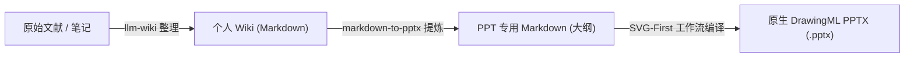

# Markdown to PPTX 📊

将 Markdown 文档直接转换为原生、可编辑且设计精美的 PowerPoint (`.pptx`) 演示文稿。

本仓库提供了一个双引擎转换器，旨在生成专业、演示就绪的幻灯片：
1. **Python 引擎 (`python-pptx`)**：非常适合严格遵循自定义企业母版模板的场景。
2. **JS Web 引擎与 AIGC 动态视觉合成 (SVG 优先与 DrawingML 编译器)**：我们提供的高级设计引擎。它能提取任何设计效果图中的视觉 DNA，并动态合成弹性布局（通过坐标 reflow 自动计算并防止文本溢出），最后通过 `ppt-master` Submodule 子模块将 SVG 元素编译为 **原生、在 PowerPoint 中完全可编辑的 DrawingML 形状**。

---

## 🎨 视觉主题与版式预览

### 1. 概念设计效果图 vs. 实际生成的 PPT 与 HTML 预览效果对比：
*   **设计概念效果图 (AIGC 生成)**：
    
*   **实际生成的 PPT 和 HTML 效果图**：
    
    

### 2. AIGC 动态主题演示 (主题：赛博朋克 HUD 与吉卜力水彩)：
| | **赛博朋克 HUD** | **吉卜力水彩风** |
|:---|:---:|:---:|
| **概念底图** |  |  |
| **生成效果** |  |  |
| *风格* | 不对称霓虹发光科技 HUD 卡片 | 蓝天绿地背景配上手绘质感羊皮纸卡片 |

---

## 🔄 集成工作流：从 Personal-Wiki 到 PPT 演示文稿

该技能被设计为 [Personal-Wiki](https://github.com/arvrschool/Personal-Wiki) 知识库生态系统中的下游重要组件：



1. **信息整理与结构化 (使用 `llm-wiki`)**：首先将原始文献或笔记整理为结构化 Wiki 页面。
2. **幻灯片大纲提炼**：`markdown-to-pptx` 过滤清洗 Obsidian 自定义语法，并提炼为以 `---` 分页的幻灯片大纲。
3. **PPT 编译生成**：使用 JS 和 Python 双端工具链编译为原生可编辑的 PowerPoint 文件。

---

## 🌟 核心特性

* **双引擎灵活性**：对于标准模板汇报使用 Python 引擎，对于 AIGC 高度定制视觉的幻灯片使用 Node.js + Python DrawingML 引擎。
* **AIGC 动态视觉合成 (SVG-First)**：
  * **视觉 DNA 提取 (`extract_visual_dna.js`)**：分析示例效果图，提取主色调、字体、圆角半径和装饰性几何体规则。
  * **渐变底图生成 (`generate_gradient.js`)**：根据提取的色彩规则，纯净渲染背景渐变图，避免直接拉伸有噪点的效果图背景。
  * **DrawingML 矢量编译 (`svg_to_dml.js` / `ppt-master` 子模块)**：将布局 SVG（矩形、线条、文本框、路径）直接编译成可编辑的 Office 形状。文本框在 MS PowerPoint 中可双击直接编辑文字。
* **排版去雷同蓝图关卡 (Anti-Duplication Blueprint Gate)**：
  * 在 Step 4 生成坐标前，强制要求 AI 必须先声明并输出**「全局布局蓝图去重自检表」**。
  * **重复次数限制**：整套 PPT 中，任何排版骨架最多出现 2 次且绝对不能连续出现。
  * **重合碰撞校验**：若某页的 Bounds 与历史页面重合度超过 85%，强制要求 AI 修改当前页的物理骨架，杜绝模版化雷同。
* **响应式布局组件**：自动根据文本字数与内容特征拟合排版：
  * **Centered Breathe (居中呼吸)**：字数极少时大字号居中展示，充满空气感。
  * **Horizontal Grid (水平栅格)**：列表数据转化为 2-3 列并排卡片。
  * **2x2 Matrix (四宫格)**：四个要点转化为田字形分布，自带语义图标与明细卡。
  * **Timeline (时序时间轴)**：有序列表转换为带连接线的横向步骤链。
  * **Asymmetric Columns (非对称双栏)**：图文混排时智能分配左右占比，防止文字爆版重叠。

---

## 🚀 安装与设置

### 1. 初始化 Submodule 子模块 (动态 JS 引擎必须)
为了将 SVG 编译为原生 DrawingML 形状，本项目依赖了 `ppt-master` 编译工具。请在安装时拉取子模块：
```bash
git submodule update --init --recursive --depth 1
```

### 2. 依赖项安装
* **Python 引擎**：安装 `python-pptx`：
  ```bash
  pip install python-pptx
  ```
* **JS 引擎**：进入 `scripts` 目录并安装依赖包：
  ```bash
  cd scripts
  npm install
  ```

---

## 💻 使用指南

### 选项 A：Python 引擎（模板驱动）
适合需要与现有企业 `.pptx` 模板严格保持对齐的汇报演示。
```bash
python scripts/md2pptx.py input.md -t corporate_template.pptx -o output.pptx
```

### 选项 B：JS Web 引擎（动态卡片与 DrawingML 编译）
适合学术论文解读、技术分享以及复杂的不对称视觉排版。

**标准转换 (一键生成 PPTX 以及 responsive HTML 预览 switcher):**
```bash
node scripts/md2pptx_web.js input.md -o output.pptx -t <theme>
```
*可选预置主题：* `light`, `dark`, `warm`, `aurora`, `forest`, `ocean`, `spatial`, `cyberpunk`, `holodeck`, `ghibli`。

**使用自定义 AIGC 效果图提炼：**
1. 提取视觉 DNA：
   ```bash
   node scripts/extract_visual_dna.js design_mockup.png <theme_name> ./
   ```
2. 根据 DNA 生成渐变背景图：
   ```bash
   node scripts/generate_gradient.js <theme_name> ./ ./assets/
   ```
3. 运行转换器：
   ```bash
   node scripts/md2pptx_web.js input.md -o output.pptx -t <theme_name>
   ```

---

## 📐 响应式布局规范

| 布局组件 | 触发条件 | 视觉样式 |
| :--- | :--- | :--- |
| **Centered Breathe** | 字数 < 120 字，无图。 | 单个居中卡片，字号增加 4pt，高留白率。 |
| **Horizontal Grid Cards** | 2-3 项无序列表。 | 水平并排的细边框圆角卡片。 |
| **2x2 Matrix Grid** | 恰好 4 项无序列表。 | 田字形排列卡片，左侧展示语义化图标。 |
| **Timeline/Sequence** | 3-5 项以数字开头的步骤。 | 带有虚线连接的横向步骤时序链。 |
| **Asymmetric Split** | 标准文本 + 至少一张图片。 | 非对称排版，左文本卡片，右图片卡片。 |

---

## 🤖 Antigravity 自定义技能集成

如果您使用的是 **Google Antigravity**，您可以将本仓库加载为您的专属 AI 技能：

1. **全局安装**：
   将 `markdown-to-pptx` 文件夹复制到您的全局自定义配置目录下：
   * Windows: `C:\Users\<用户名>\.gemini\skills\markdown-to-pptx`
   * Linux/macOS: `~/.gemini/config/skills/markdown-to-pptx`

2. **项目级安装**：
   直接放置在您项目根目录下的 `.agents/skills/markdown-to-pptx` 目录中。

加载完成后，Antigravity 助手在收到 PPT 生成指令时，会自动调用本技能并通过交互式模态框确认您的引擎、丰富度及偏好主题。

---

## 📄 开源协议
本项目基于 MIT 协议开源。
