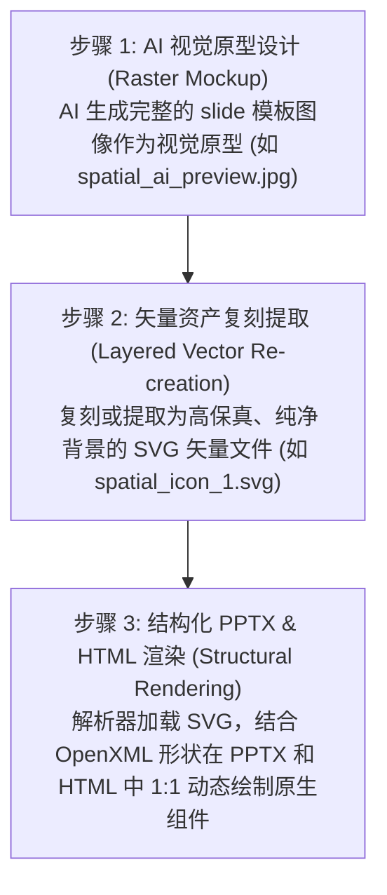

# Markdown to PPTX

## ⚠️ INITIALIZATION TRIGGER (Action Required on Invocation)

Whenever you are asked to generate a PPTX from Markdown using this skill, you **MUST** follow this sequential, branched interaction flow to gather the user's preferences before doing any work:

### Step 1: Initial Question Modal
Use your `ask_question` tool to present an interactive modal containing ONLY the first two questions:

**Question 1: Template & Presentation Engine Mode**
- Option A: JS Web Engine - Precompiled Visual Themes (Minimalist Light, Cyber Dark, Cyberpunk, Warm Editorial, Aurora Purple, Sage Forest, Deep Ocean)
- Option B: JS Web Engine - AIGC Dynamic Synthesis (Spatial/Custom Mockup) - Overlays vector shapes and text cards onto an AI-generated or custom background slide template.
- Option C: Python Engine - Slide Master Template (Relies on PPT autofit, best used if you have a strict custom corporate `.pptx` template)

**Question 2: Content Richness Level**
- Option A: Medium (Standard) - High-level overview, workflow, and final results.
- Option B: High (Paper Reading) - Deep dive, includes detailed architectural choices, loss functions, and ablation data.

*Do NOT include the preset themes selection question in this first modal, as it is only applicable to Option A.*

### Step 2: Dynamic Branching based on Question 1 Selection
Once the user submits their choices for Step 1, branch as follows:

#### Branch A: If user chose Option A (Precompiled Visual Themes)
Immediately use the `ask_question` tool again to ask the theme selection question:
**Question 3: Specific Preset Theme**
- Option A: (Recommended) All Preset Themes - Generates all 8 preset themes with an interactive switcher HTML preview.
- Option B: Minimalist Light - Clean light theme with corporate blue accents.
- Option C: Cyber Dark - Tech-inspired dark theme with glowing neon sky-blue accents.
- Option D: Cyberpunk - Cyberpunk tech dark theme with custom HUD widgets and neon purple/cyan accents.
- Option E: Warm Editorial - Serif typography with warm sand/beige tones.
- Option F: Aurora Purple - Creative playful theme with violet and magenta accents.
- Option G: Sage Forest - Serene natural green tones for a calming corporate look.
- Option H: Deep Ocean - Trustworthy corporate deep blue theme.
- Option I: Spatial AI - Dark teal spatial intelligence theme with grid background and rounded cards.

#### Branch B: If user chose Option B (AIGC Dynamic Synthesis)
Do NOT proceed immediately. You **MUST** first ask the user in Chinese to provide a style template mockup image path, or ask if they want you to generate one using the image generation tool. You must offer to the user a few Chinese prompt examples (like spatial, cyberpunk, holodeck HUD designs) and ask them to choose or write their own prompt. You cannot compile or write DSL layout files until the template visual tone is aligned.

**AIGC Prompt Examples in Chinese (AIGC 效果图生成 Prompt 预设示例库)**:
- **Spatial AI (具身空间风格)**: "一张用于人工智能演示的 premium 16:9 宽屏幻灯片效果图。背景是干净的深青色和石灰色空间界面，带有微妙的网格结构和柔和的青色发光线条。中央是一个第一人称视觉追踪视口（HUD），显示机器人在干净房间中追踪目标的画面，带有圆形雷达扫描、数字坐标标签和悬浮的数据统计卡片。设计现代，带有优雅的科技元素、高科技接口矢量和半透明的深色浮动面板。宽屏，幻灯片演示模板。"
- **Cyberpunk (赛博朋克 HUD 风格)**: "一张 premium 宽屏 16:9 演示文稿幻灯片模板效果图。深蓝色和碳灰色深邃终端背景，点缀着高科技 HUD 挂件、未来感遥测图表和诊断控制台面板。卡片采用不对称形状，带有发光的紫色霓虹边缘、黄色对齐十字线和数字数据叠加。高对比度，科幻机械控制台美学，未来感科技演示幻灯片。"
- **Holodeck (全息圆心扫描风格)**: "一张时尚的 16:9 演示模板效果图，背景深邃，带有发光的琥珀色网格线。具有居中的三维扫描球体（雷达全息图），展示了琥珀色和金色发光的网格重建线。优雅简约的布局，配有对称的悬浮玻璃面板、坐标文本读数和发光的状态指示线。干净的排版占位符，奢华未来感演示主题。"

Once the template image is aligned, execute the **Unified Style AIGC Layout Generation Workflow** (单模板多页 AIGC 动态排版与复刻标准工作流):

1. **Layered Style Extraction (单模板分层原则)**:
   * **Only 1 style template image (1 张模板效果图)** is provided by the user (or generated to set the visual tone, e.g., `spatial_ai_preview.jpg` or `cyberpunk_premium_mockup.jpg`).
   * From this single template, extract/provide:
     * **Background Image (背景底图)**: e.g., `assets/[theme]_bg.jpg` (or slide-specific background variants `assets/[theme]_bg_slide_${idx}.jpg` if extracted from the template).
     * **Foreground Vectors (前景矢量)**: e.g., SVG icons or logo overlays (e.g., `assets/spatial_icon_1.svg`).
     These base assets are reused/shared across the slides to maintain extreme visual consistency.

2. **Content Planning & Page Prompt Formulation (内容规划与单页 Prompt 设计)**:
   * Read the raw document content (e.g., Markdown slides).
   * **布局动态适配原则（拒绝套用与偷懒）**：不同的 AIGC 模板风格具备其独特的视觉构成规律与布局隐喻。布局设计必须根据用户所选择/生成的 AIGC 模板风格，结合其独特的视觉构成规律，动态计算和规划每一页幻灯片的 Layout DSL JSON，绝对禁止为了偷懒而在不同模板间直接克隆、复制相同的百分比 bounds 坐标。布局设计应根据模板风格（如环形扫描、高密度 HUD、悬浮流式等）动态衍生专属的 bounds，实现结构异构。
   * For each slide `i`, formulate a detailed **Page Layout Prompt (单页排版设计指令)** outlining:
     * Layout theme and logic (e.g., 2x2 grid, timeline steps, comparison columns).
     * Coordinate bounds (`bounds`) for each element (`text`, `card`, `vector`, `image`, `timeline`).
     * Expected simple interactive behaviors (hover triggers, radar rotations, pulsing markers).
     * Specific vector decorators (`radar-sweep`, `spatial-sphere`, etc.) to embed.
   * **Always print these layout prompts in your response to the user so they can review the layout decisions.**

3. **HTML Layout & Interactive Prototype Generation (前端交互原型生成)**:
   * Build the Layout DSL JSON representation using absolute percentage coordinates.
   * The compiler converts this DSL to HTML, rendering custom components (`premium-card`, `cyber-chassis`, custom SVGs) and applying CSS transitions for simple interactions.
   * **资源自动同步**：编译器在生成 HTML 文件时，会自动在其同级目录下创建 `assets/` 文件夹，并将内置的背景图、SVG 图标从 Skill 资源目录中复制过去，确保 HTML 预览能正确加载背景底图和矢量图。

4. **1:1 PPTX Compilation (PPTX 编译复刻)**:
   * The compiler maps the DSL bounds mathematically to physical slide inches and generates the native, editable PPTX presentation, ensuring matching layouts, text wrapping, and zero newline character bugs.
   * **主题布局自动寻址**：在对特定主题进行 PPTX 编译时，编译器会自动在输入 Markdown 的同级目录下检测是否存在 theme 专属的 `${themeKey}_deck.json` 布局文件。若存在则读取该布局重新渲染，保证输出的 PPTX 和 HTML 预览页面排版绝对对齐一致。

#### Branch C: If user chose Option C (Python Slide Master)
Ask the user to provide the path to their custom corporate template `.pptx` file (e.g. `corporate_template.pptx`). Compile the slides using python-pptx.

Converts Markdown directly into native, editable PowerPoint (.pptx) presentations using Python.

## Core Capabilities
- **Title Slides**: Automatic detection of H1 `#` headers at the start.
- **Content Slides**: Automatic splitting of slides using horizontal rules `---`.
- **Bullet Points**: Nested bullet point lists (`- ` or `* `).
- **Speaker Notes**: Extract notes using HTML comments (`<!-- notes: ... -->`).
- **Image Insertion**: Parses Markdown image syntax (``).
- **Templating**: Automatically inherits styles, fonts, and master layouts from an optional template `.pptx` file.

## Usage

You have two engine options depending on your layout precision needs.

### Option 1: Python Engine (Template-driven)
Best for strict adherence to corporate slide masters and standard text sizes.
```bash
python3 scripts/md2pptx.py input.md -o output.pptx
```
With a custom corporate template:
```bash
python3 scripts/md2pptx.py input.md -t corporate_template.pptx -o output.pptx
```
*(Requires `python-pptx`)*

### Option 2: JS Web Engine (Dynamic Font Scaling)
Best for high-density content where you want the script to calculate and dynamically shrink/grow text boundaries based on the presence of images to prevent overflow.
```bash
node scripts/md2pptx_web.js input.md -o output.pptx -t <theme>
```
Where `<theme>` is one of: `all`, `light`, `dark`, `warm`, `aurora`, `forest`, `ocean`, `spatial`, `cyberpunk`.
*(Requires `pptxgenjs` via Node.js)*

## AIGC Slide Generation Paradigm (基于 AI 矢量分层的幻灯片生成范式)

为了克服传统 AI 生成幻灯片时出现的“位图截图模糊、背景杂色残留、绿边溢出、无法自适应主题”等系统性问题，本 Skill 引入了全新的 **AI 矢量分层生成与 1:1 精准复刻范式**：



### 1. 核心实践原则：
* **无位图污染**：严禁在 PPT 卡片中直接贴入包含背景的截图（PNG/JPEG），这会导致背景渐变冲突与 JPEG 压缩噪点。必须使用纯净、透明的 SVG 矢量图。
* **高清晰度无限缩放**：采用 SVG 代码（如 `<svg viewBox="0 0 100 100">`），保证在 PPT 任意缩放或投影时边缘极致锐利，且支持在 PowerPoint 中右键转换为 Office 形状进行二次编辑。
* **分层组件化对齐**：卡片卡板使用 PPTX 原生 Shape 绘制（设置 `cardBorder` 和 `cardBg`），图标作为独立 SVG 覆盖在其上方（`sizing: { type: "contain" }`），文字使用原生文本框（Text Box）渲染，从而使整个页面完全可编辑。

---

## Workflow & Content Generation

Before generating the Markdown for the presentation, you must determine or ask the user for the **Content Richness Level** (内容丰富度尺度) needed. Do not treat all presentations equally.

### 1. Medium Richness (Standard Presentation)
- **Target Audience:** General audience, high-level overviews.
- **Content:** Focuses on core concepts, workflow, and final results.
- **Format:** Bullet points, no deep formulas. High-level architecture diagrams.

### 2. High Richness (Paper Reading / Academic Level)
- **Target Audience:** Researchers, deep-dive discussions.
- **Content:** Must include detailed technical constraints (e.g., Loss function structures), specific algorithmic components (e.g., Causal Masks, Attention Matrices), and ablation study data proving why components work.
- **Format:** Precise technical terminology. Formulas should be linearized into structured text so they render cleanly in PPTX. 

*Always adapt your markdown summarization depth based on these richness scales before running the generation engine.*

## Responsive UI Layout Component System (Design Guidelines)

To make presentations look premium like Apple Keynote or McKinsey decks rather than "cheap templates", the JS Web Engine runs a responsive component layout selector based on content structure:

| Layout Component | Markdown Trigger Condition | Layout Output Design |
| :--- | :--- | :--- |
| **Centered Breathe** (居中呼吸版式) | Small text volume (< 120 chars) and no image/no cards. | A single centered card, width 50-60%, vertical & horizontal centering, enlarged fonts (+4pt), airy spacing. |
| **Horizontal Grid Cards** (水平栅格卡片) | 2 to 4 bullet points formatted as `- **Title**: Body` or `- Title: Body`. | Horizontally aligned cards (2-4 columns) with thin borders, light card backgrounds, and accent color headers. |
| **Timeline/Sequence** (时间轴/步骤链) | 3 to 5 numbered steps (e.g. `1. **Step**: Description` or titles containing step indicators/dates). | A horizontal dashed timeline with accent color nodes, step numbers above, and column cards below. |
| **Asymmetric Split** (非对称双卡片) | Text content + an image. | Left text card (accent header), right vertically-centered image card. If the image is flat/wide, alt text `` renders as a caption card underneath. |

### Design Tokens (Industrial Refinement)
*   **Background De-noising**: Never use pure white backgrounds. The engine defaults to `#F8FAFC` or `#F4F6F8` (micro-cold-gray) to let white cards stand out with subtle elevation (shadows/borders).
*   **Text Softening**: Avoid pure black (`#000`), using graphite slate (`#1E293B` or `#334155`) for titles and body.
*   **Font Step Rigidness**: Title (28pt) -> Subtitle/CardHeader (16pt, Semi-Bold) -> Body (12-13pt, Regular). 

---

## Engineering Guidelines & Lessons Learned (CRITICAL)

When modifying the `md2pptx.py` script or building custom layouts, strictly adhere to these rules discovered through iterative debugging:

1. **Never Hardcode Body Font Properties**: Explicitly setting `run.font.size`, `run.font.name`, or `paragraph.line_spacing` for standard body text will **break PowerPoint's native `MSO_AUTO_SIZE.TEXT_TO_FIT_SHAPE` feature**. It also strips away the native bullet point styles (like dots or dashes) inherited from the Slide Master. Let the PPTX master template handle base typography and auto-scaling. Only apply run-level styling for explicit inline formatting (like `run.font.bold = True`).
2. **Safe Image Margins**: When implementing two-column mixed layouts (text + image), never allocate 100% of the slide width. Always leave a minimum 5% margin on the outer edges and a 5% gap between columns to prevent wide images from bleeding off the slide (e.g., Text: 40%, Gap: 5%, Image: 50%, Right Margin: 5%).
3. **Default to 16:9 Aspect Ratio**: If no user template is provided, the script should automatically instantiate a 16:9 widescreen format (`slide_width = Inches(13.333)`, `slide_height = Inches(7.5)`). The `python-pptx` default 4:3 format looks severely outdated.

---

## Markdown Syntax Guidelines

To ensure perfect mapping to PowerPoint layouts, use the following conventions in the Markdown file:

```markdown
# Presentation Title
Subtitle line 1
Subtitle line 2

---

## Centered Breathe Example
This is a single central idea or quote. Because it has very few characters, it triggers the Centered Breathe layout automatically with large text and wide padding.

---

## 3-Column Grid Cards Layout
- **多任务超越**: 在 12 项空间几何测试中超越人类专家。
- **3D 涌现**: 无需 3D 标签，自动生成一致的立体结构。
- **零样本迁移**: 直接适配未见过的建筑仿真环境。

---

## Timeline Step Layout
1. **模型定义**: 定义 4D 空间寄存器标记及位置编码。
2. **时空交互**: 寄存器标记在自注意力机制中融合上下文信息。
3. **解码重建**: 解码并投影回 3D 空间，输出 4D 世界动作状态。

---

## Asymmetric Image Layout
- **双通道融合**: 文字放置在左侧卡片，右侧自适应居中对齐模型结构图。
- **动态重心补偿**: 如果结构图高度较矮，下方将渲染图注卡片。


```

---

## AIGC Layout DSL Specification & Compilation (AIGC 布局 DSL 规范与编译架构)

为了彻底解决“固定排版模板导致生成幻灯片千篇一律、缺乏个性化”的问题，本系统提供了一种**动态 AIGC 布局 DSL 驱动**的编译架构。大模型根据具体页面内容与风格，生成 JSON 格式的幻灯片布局 DSL，再由编译器将其 1:1 复刻为 PPTX 与 HTML 演示文稿。

### 1. JSON Layout DSL Schema (布局 DSL 模式规范)
每一个幻灯片文件为一个 JSON 对象，其根节点为 `slides` 数组。每个 Slide 结构如下：
*   `slideIndex`: (Integer) 幻灯片序号（0-indexed）。
*   `layoutType`: (String) 页面排版布局名称类型（如 `title`, `radar-sweep`, `grid-2x2`, `timeline`, `split-image`）。
*   `title`: (String) 幻灯片页面级标题。
*   `background`: (Object) 包含 `image`（背景图文件名） 和 `fallbackColor`（背景兜底色十六进制）。
*   `elements`: (Array) 页面中所有可见组件的数组。

#### 元素类型规范 (Element Types):
*   **`text`**: 用于普通富文本或标题块。
    *   `content`: (String) 支持行内 Markdown（如粗体、高亮、斜体）。
    *   `style`: (Object) 支持 `fontSize` (Number), `fontWeight` ("normal"|"bold"), `color` ("activeCyan"|"activePurple"|"text-main"|"text-muted"|"neon-green"|"neon-orange"), `align` ("left"|"center"|"right"), `valign` ("top"|"middle"|"bottom")。
*   **`card`**: 用于高保真的内容科技卡片。
    *   `id`: (String) 卡片唯一标志，编译器自动将其转换为顶部的英文科技标签（如 `COMPONENT 01`）。
    *   `style`: (Object) 支持 `theme` ("default"|"accent"|"subtle")。
    *   `content`: (Object) 包含 `title` (String) 和 `body` (Markdown String)。
*   **`image`**: 包含自适应的图像渲染框。
    *   `content`: (Object) 包含 `path` (String) 指向图像的绝对或相对路径。
*   **`vector`**: 渲染高精细的矢量科技动画/纹理装饰。
    *   `name`: ("radar-sweep"|"spatial-sphere"|"viewfinder-reticle"|"timeline-pulse"|"multiview-diagnostic")。
*   **`timeline`**: 用于横向串联多步骤步骤流。
    *   `content`: (Array) 内含步骤项 `{ title: String, body: String }` 的数组。

#### Bounds (百分比坐标定义):
所有元素均包含 `bounds` 对象，定义为占幻灯片宽高（13.333 in * 7.5 in）的百分比字符串：
`"bounds": { "x": "X%", "y": "Y%", "w": "W%", "h": "H%" }` (例如 `"bounds": { "x": "10%", "y": "20%", "w": "40%", "h": "60%" }`)。

### 2. Layout Compilation Math (布局编译与单位换算)
编译器必须支持将百分比 bounds 1:1 双端解析：
*   **HTML Preview**: 转换成 CSS 绝对定位属性：
    `position: absolute; left: X%; top: Y%; width: W%; height: H%;`
*   **PowerPoint (OpenXML/pptxgenjs)**: 转换成物理英寸单位：
    *   $X_{inch} = (X / 100) \times 13.333$
    *   $Y_{inch} = (Y / 100) \times 7.5$
    *   $W_{inch} = (W / 100) \times 13.333$
    *   $H_{inch} = (H / 100) \times 7.5$

### 3. Usage & Compilation Execution (编译执行指令)
直接传入 `.json` 格式的 DSL 描述文件即可启动双端渲染：
```bash
node scripts/md2pptx_web.js tests/test_deck.json -o output.pptx -t all
```
该指令会验证 JSON 格式，编译出 `output.html` (支持一键切换 8 大主题的预览与切换) 以及对应的 `output_spatial.pptx` / `output_cyberpunk.pptx` 等实体幻灯片。

---

## 幻灯片布局设计准则 (Layout Design Guidelines)

1. **布局动态适配原则（拒绝偷懒套用）**：
   对于每一套不同的 PPTX 视觉风格，设计者必须动态根据用户所选择或生成的 AIGC 模板视觉特征与排版规律，重新计算并生成专属的 Layout DSL JSON（包括卡片、图片和矢量图形的绝对百分比 bounds），绝对禁止直接复制或直接克隆其他主题的百分比坐标。具体的布局范式（如对称分列、圆心向心布局、高密度不对称网格、大呼吸感流式布局等）应基于模板图像的物理布局逻辑进行动态提取与映射。

2. **内容对齐与完整性**：
   在为特定视觉主题精化 JSON 布局文件时，必须核对 Markdown 文档的全部 bullet points 细节，确保每个层级的数据及关键项都完美映射到 DSL 卡片中。严禁在生成新坐标时遗漏、过滤或删减原幻灯片的内容卡片，造成页面空白或信息缺失。

3. **效果图前置确认原则（拒绝盲目生成）**：
   在 AIGC 动态合成（Option B）工作流时，设计者严禁在未与用户确认效果图或未生成预览 Mockup 图的情况下直接进行代码编译和排版。必须前置用中文询问用户是否提供效果图路径，并提供中文 Prompt 示例，让用户提供或确认绘图指令后再进行生成，待视觉基调明确后再开始精化 Layout DSL 并编译双端。

4. **图片感知与图文分流原则（有无图片必须区分处理）**：
   在规划 Layout DSL 前，设计者必须先扫描源 Markdown 文档是否含图片（Markdown 语法 `` 或 Obsidian 嵌入 `![[file]]`），并据此区分版式——绝对禁止无视文档图片、用纯文字卡片敷衍了事：
   - **文档含图片时**：必须使用 `image` 元素将图片嵌入对应幻灯片（严禁仅用文字卡片替代或遗漏图片）。含图页采用 **Asymmetric Split（非对称双卡片）** 版式——一侧文字卡（accent 头）、另一侧 `image` 元素；严格遵守「Safe Image Margins」硬规则：外缘 ≥5% 边距、列间 ≥5% 间隙（推荐配比 文字 40% / 间隙 5% / 图 50% / 右边距 5%）。若图片宽扁或高度偏矮，在其下方渲染图注卡（alt 文本）。架构图/流程图/teaser 等关键图应优先安排到对应主题页（方法页放架构图、训练/推理页放流程图、问题页放 teaser 对比图、实验页放真实世界示图）。
   - **文档无图片时**：使用纯文字版式（Centered Breathe / Horizontal Grid Cards / Timeline / 单卡等），不得强行预留空白图位或编造图。
   - **路径解析**：`image.content.path` 为相对路径时以 DSL JSON 文件所在目录为基准；建议将所需图片拷贝到 deck 同级 `figures/` 目录后用相对路径引用（如 `figures/fig-2.png`），确保 PPTX 与 HTML 双端均可加载。Obsidian 的 `![[Pasted image xxx.png]]` 嵌入需先在知识库中定位实际文件路径再拷贝引用。

5. **文档目录隔离原则（避免主题布局自动寻址串台）**：
   每篇文档必须使用**独立的输出目录**，该文档专属的 `${themeKey}_deck.json`（如 `ghibli_deck.json` / `cyberpunk_deck.json`）连同 `figures/` 图片子目录、生成的 `.pptx` / `.html` 一并放在其中。严禁在同一个目录里混放多篇文档的 deck JSON。原因：编译器存在「主题布局自动寻址」机制——`generatePptxForTheme` 会以 `path.dirname(inputFile)/${themeKey}_deck.json` 查找并**覆盖加载**（见 `md2pptx_web.js` 该函数）；若目录里残留旧文档的 `ghibli_deck.json`，对新文档跑 `-t ghibli` 时会**误用旧布局**，造成跨文档版式串台。推荐目录命名：`<文档名>_<主题>/`（如 `wam4d_ghibli/`），内含该文档的 `ghibli_deck.json` + `figures/` + 输出文件。
```