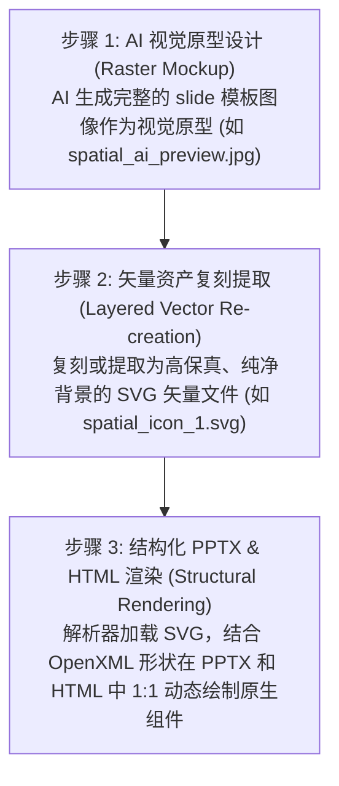

The following code has been modified to include a line number before every line, in the format: <line_number>: <original_line>. Please note that any changes targeting the original code should remove the line number, colon, and leading space.
---
name: markdown-to-pptx
description: Converts Markdown files directly into native, editable PowerPoint (.pptx) presentations using a structured syntax and layout selector. Make sure to trigger this skill whenever the user wants to generate a PPT, create slides, convert markdown to PowerPoint, or design dynamic slide decks, even if they don't explicitly mention 'markdown-to-pptx' or have content pre-formatted in markdown.
---

# Markdown to PPTX

## ⚠️ INITIALIZATION TRIGGER (Action Required on Invocation)

Whenever you are asked to generate a PPTX from Markdown using this skill, you **MUST** follow this sequential, branched interaction flow to gather the user's preferences before doing any work:

### Step 1: Initial Question Modal
Use your `ask_question` tool to present an interactive modal containing ONLY the first two questions:

**Question 1: Template & Presentation Engine Mode**
- Option A: JS Web Engine - Precompiled Visual Themes (Minimalist Light, Cyber Dark, Cyberpunk, Warm Editorial, Aurora Purple, Sage Forest, Deep Ocean, Spatial AI, Holodeck, Ghibli Anime)
- Option B: JS Web Engine - AIGC Dynamic Synthesis (Spatial/Custom Mockup) - Overlays vector shapes and text cards onto an AI-generated or custom background slide template.
- Option C: Python Engine - Slide Master Template (Relies on PPT autofit, best used if you have a strict custom corporate `.pptx` template)

**Question 2: Content Richness Level**
- Option A: Medium (Standard) - High-level overview, workflow, and final results.
- Option B: High (Paper Reading) - Deep dive, includes detailed architectural choices, loss functions, and ablation data.

*Do NOT include the preset themes selection question in this first modal, as it is only applicable to Option A.*

### Step 2: Dynamic Branching based on Question 1 Selection
Once the user submits their choices for Step 1, branch as follows:

#### Branch A: If user chose Option A (Precompiled Visual Themes)
Immediately use the `ask_question` tool again to ask the theme selection question:
**Question 3: Specific Preset Theme**
- Option A: (Recommended) All Preset Themes - Generates all 10 preset themes with an interactive switcher HTML preview.
- Option B: Minimalist Light - Clean light theme with corporate blue accents.
- Option C: Cyber Dark - Tech-inspired dark theme with glowing neon sky-blue accents.
- Option D: Cyberpunk - Cyberpunk tech dark theme with custom HUD widgets and neon purple/cyan accents.
- Option E: Warm Editorial - Serif typography with warm sand/beige tones.
- Option F: Aurora Purple - Creative playful theme with violet and magenta accents.
- Option G: Sage Forest - Serene natural green tones for a calming corporate look.
- Option H: Deep Ocean - Trustworthy corporate deep blue theme.
- Option I: Spatial AI - Dark teal spatial intelligence theme with grid background and rounded cards.
- Option J: Holodeck - Retro-future amber hologram theme with scanning sphere and glowing grid lines.
- Option K: Ghibli Anime - Studio Ghibli watercolor anime style with hand-drawn parchment cards on meadow scenery, warm Georgia serif typography.

#### Branch B: If user chose Option B (AIGC Dynamic Synthesis)

Do NOT proceed immediately. You **MUST** first ask the user in Chinese to provide a style template mockup image path, or ask if they want you to generate one using the image generation tool. You must offer to the user a few Chinese prompt examples (like spatial, cyberpunk, holodeck HUD designs) and ask them to choose or write their own prompt. You cannot compile or write DSL layout files until the template visual tone is aligned.

**AIGC Prompt Examples in Chinese (AIGC 效果图生成 Prompt 预设示例库)**:
- **Spatial AI (具身空间风格)**: "一张用于人工智能演示的 premium 16:9 宽屏幻灯片效果图。背景是干净的深青色和石灰色空间界面，带有微妙的网格结构和柔和的青色发光线条。中央是一个第一人称视觉追踪视口（HUD），显示机器人在干净房间中追踪目标的画面，带有圆形雷达扫描、数字坐标标签和悬浮的数据统计卡片。设计现代，带有优雅的科技元素、高科技接口矢量和半透明的深色浮动面板。宽屏，幻灯片演示模板。"
- **Cyberpunk (赛博朋克 HUD 风格)**: "一张 premium 宽屏 16:9 演示文稿幻灯片模板效果图。深蓝色和碳灰色深邃终端背景，点缀着高科技 HUD 挂件、未来感遥测图表和诊断控制台面板。卡片采用不对称形状，带有发光的紫色霓虹边缘、黄色对齐十字线和数字数据叠加。高对比度，科幻机械控制台美学，未来感科技演示幻灯片。"
- **Holodeck (全息圆心扫描风格)**: "一张时尚的 16:9 演示模板效果图，背景深邃，带有发光的琥珀色网格线。具有居中的三维扫描球体（雷达全息图），展示了琥珀色和金色发光的网格重建线。优雅简约的布局，配有对称的悬浮玻璃面板、坐标文本读数和发光的状态指示线。干净的排版占位符，奢华未来感演示主题。"

Once the template image is aligned, execute the **Unified Style AIGC Layout Generation Workflow with Visual DNA Extraction** (视觉 DNA 提炼 + 单模板多页 AIGC 动态排版标准工作流):

> ⚠️ **核心范式升级 (image-to-code paradigm)**：严禁将用户提供的图片模板直接作为背景底图贴入幻灯片。所有图片模板必须经过视觉 DNA 提炼流程，从中提取出**设计规则系统**，再用规则驱动底图生成和布局设计，确保原创性与可扩展性。

---

#### Step 1: 视觉 DNA 提炼 (Visual DNA Extraction) 🔍

**这是整个流程的核心新步骤，必须最先执行。**

当用户提供图片模板路径后，运行提炼脚本：

```bash
node scripts/extract_visual_dna.js <image_path> <theme_key> <project_dir>
# 示例
node scripts/extract_visual_dna.js /mnt/c/Users/Administrator/Downloads/template.png jryw4 /mnt/c/Users/Administrator/Downloads/edu_project/
```

脚本会调用 **Gemini Vision API** 对模板图片进行 **7 个标准维度**的系统性分析：

| 维度 | 提炼内容 |
|---|---|
| **palette（色彩语义角色）** | bg / cardBg / cardBorder / titleColor / textColor / accentColor / gradientStart / gradientEnd / gradientDirection |
| **typography（字型规则）** | headingFont / bodyFont / headingWeight / headingScale / bodyScale / letterSpacing / lineHeight |
| **spacing（间距节奏）** | 基础间距单位 / 页面留白感 / 卡片内边距 / 元素间距 |
| **componentGrammar（组件语法）** | 卡片圆角 / 投影强度 / 卡片风格（flat/glass/outlined/filled）/ 图标风格 |
| **decorativeVocabulary（装饰元素词汇）** | 所有装饰元素的类型 / 颜色 / 透明度 / 位置 / 大小 |
| **layoutPattern（布局模式）** | 列数 / 内容分割方向 / 顶部标题样式 / 底部样式 / 是否有斜切块 |
| **mood（视觉情绪定位）** | 情绪调性 / 是否深色主题 / 活跃程度 / 最佳使用场景 |

提炼结果输出为 `<themeKey>_visual_dna.json` 并自动同步到 `scripts/themes.json`。

**你（Agent）在阅读到 DNA 后，必须向用户展示提炼摘要**，并根据提炼结果制定后续的布局设计策略。禁止忽略 DNA 直接开始 DSL 设计。

---

#### Step 2: 纯净底图生成 (Clean Background Generation) 🎨

**严禁将原始模板图片作为背景底图。** 运行底图生成器：

```bash
node scripts/generate_gradient.js <theme_key> <project_dir>
# 示例
node scripts/generate_gradient.js jryw4 /mnt/c/Users/Administrator/Downloads/edu_project/
```

脚本读取 `visual_dna.json` 中的 `palette.gradientStart/End/Direction`，以纯 Node.js 像素运算生成 **1280×720 高保真渐变底图**，并根据 `decorativeVocabulary` 叠加半透明几何纹理（圆环、点阵、斜线等），最终保存为编译器 `assets/<themeKey>_bg.jpg`。

**背景图纯净的关键意义**：
- 无文字/水印/布局标注的干净底图，完全不污染内容层
- 所有装饰元素以 DSL `decoration` 矢量节点形式动态绘制，保持可编辑性
- 不同项目使用同一主题时，可独立调节渐变参数而不影响他人

---

#### Step 3: DNA 驱动的 DSL 布局设计 (DNA-Driven Layout Design) 🏗️

读取 `visual_dna.json` 中的 **decorativeVocabulary** 和 **layoutPattern** 字段，作为每一页 DSL 布局的设计指导：

**基于 DNA 的布局规则推导示例**：

| DNA 字段值 | → | DSL 设计决策 |
|---|---|---|
| `layoutPattern.contentSplit: "left-heavy"` | → | 封面用 `diagonal-split` 切割，左 40% 深色块+图标，右 60% 内容 |
| `layoutPattern.hasDiagonalCut: true` | → | 每个章节过渡页加 `decoration: "diagonal-split"` 元素 |
| `decorativeVocabulary: [{type:"circle-ring", placement:"top-right"}]` | → | 在指标卡页的右上角区域放置 `decoration: "circle-ring"` |
| `componentGrammar.cardStyle: "glassmorphism"` | → | 所有卡片使用 `variant: "glass"` |
| `palette.gradientDirection: "diagonal"` | → | `diagonal-split` 装饰块使用 `gradientStart` 到 `gradientEnd` 的对角渐变色 |
| `mood.tone: "playful"` | → | 结语页使用 4 列徽章网格 + 大字金句，而非严肃的辐射图 |

**布局异构原则（去雷同约束）**：必须根据每一页的**内容类型**分别从头设计不同的布局结构，绝不允许所有页面无脑套用相同的 bounds 坐标模板，也不允许在不同 PPT 项目间直接复制物理坐标骨架。

##### 🚨 排版去雷同与内容驱动强约束契约 (Mandatory Anti-Duplication Contract)：
1. **语义特征到几何图形的强制映射**：
   - **数值指标/实验数据**：必须在前景中绘制原生表格 grid（用 line 或 rect 划分）或仪表盘 Dashboard 看板样式。
   - **时间/推进流程**：根据具体步骤数，灵活设计横向链式连线、纵向时间路径轴、折线路线图、或阶梯递进板块。
   - **架构解耦/系统拓扑**：根据模块数量与关系，使用不等宽双栏、三叉戟分支拓扑、嵌套框图或中心辐射环，严禁简化为普通的等宽卡片并排。
   - **公式定理/物理规律**：使用大型居中的“透镜眼眶”公式卡片或左右对称的等宽学术投影分栏。
2. **禁止上下文“坐标锚定拷贝”**：
   - 严禁在生成新页面时，直接复制前序幻灯片页面（或前一个 PPT 项目）已通过编译的 x/y/w/h 物理坐标。
   - 每一页的 bounds 尺寸均须重新根据文字的字数与几何关联进行独立 reflow 计算，并主动引入 3%~5% 的非对称物理扰动偏差（Asymmetric Jittering），打破绝对的对称死板感。
3. **页面节奏轴（Page Rhythm）强制编排**：
   - 每一页必须在 `spec_lock.md` 或 DSL 描述中绑定页面节奏（`anchor` / `dense` / `breathing`）。
   - `anchor` 页（如封面、章页）必须保证留白率在 60% 以上，使用大字金句或居中大图；`dense` 页（如实验或方法页）允许紧凑的网格；`breathing` 页强调单点聚焦。全 deck 严禁出现同质的视觉密度。

* **指标总览页** → 非对称大卡 + 叠层小卡（不等宽分栏，Dashboard 布局）
* **列表技术页** → 3/4 列等高竖向卡片栅格（带有 X 轴非对称扰动）
* **流程阶段页** → 纵向时间路径流（左侧垂直线 + 右侧横向卡片）
* **系统概述页** → 上下一分为二（大宽概述卡 + 3 列指标卡）
* **架构流程页** → 从左至右横向管道（3 列链式 + 箭头连线）
* **数据图表页** → 左侧 chart 元素 + 右侧 2 个堆叠摘要卡
* **结语愿景页** → 4 列 milestone 网格 + 底部通栏金句背景块

---

#### Step 4: 内容规划与全局去重自检 (Content Planning & Global Anti-Duplication Gate) 📝

##### 1. 【强制拦截】全局布局蓝图声明表 (Global Layout Blueprint Declaration)
在编写任何单页 SVG 坐标或 DSL 之前，**必须**在你的思考/回答中输出以下「全局布局蓝图表」，对整套 PPT 所有的页面骨架进行统筹规划与自检，拒绝“边想边写”导致的格式收敛和雷同：

| 页码 | 内容语义特征 (如:封面/痛点/架构) | 页面节奏 (anchor/dense/breathing) | 物理排版骨架 (如:右置长卡/3层扁平叠卡/2x2田字格) | 核心几何锚点范围 (用x/y/w/h区间表示) | 异构去重自检 (必须与前后N页完全不同) |
|---|---|---|---|---|---|
| P1 | 封面 | anchor | 右侧竖长卡片 + 左侧大面积4D轨迹留白 | 卡片: `x=820,y=40,w=420,h=640` | 已确认：封面首次采用右置大长卡，无雷同 |
| P2 | 痛点/背景 | dense | 3层纵向扁平阶梯叠层卡片 | 每层: `x=80,w=1120,h=130`, `y=180/330/480` | 已确认：全新纵向卡片层叠，与封面和P3完全异构 |
| ... | ... | ... | ... | ... | ... |

##### 2. 【去重拦截规则】
- **结构重复率上限**：整套 PPT 中，完全相同的布局骨架（如“等高双栏卡片”）**出现次数不能超过 2 次**，且**绝对不能连续出现**。
- **几何锚点重合校验**：如果两页的「核心几何锚点范围」在 x, y 坐标上的重合度超过 85%（即完全重叠），必须强制修改其中一页的物理排版骨架（例如将等宽双栏修改为非对称左右分栏或 1+2 混合卡片）。

##### 3. 单页详细排版设计指令 (Page Layout Prompt)
完成全局蓝图声明和自检后，为每一页 `i` 制定详细的单页排版设计指令：
* Layout theme and logic derived from the DNA (e.g., 2x2 grid based on `layoutPattern.gridColumns`).
* Coordinate bounds (`bounds`) for each element.
* DNA-derived decoration elements to embed (e.g., place `circle-ring` at `decorativeVocabulary[0].placement`).
* **Always print these layout prompts and the Self-Check table in your response to the user so they can review the layout decisions.**

---

#### Step 5: HTML & PPTX 双端编译 (Dual-End Compilation) ⚙️

```bash
# 编译出 HTML 预览 + PPTX 文件
node scripts/md2pptx_web.js <project_dir>/<themeKey>_deck.json <project_dir>/output.pptx -t <themeKey>

# 截图审查
node scripts/screenshot.js /path/to/output.html <project_dir>/previews/
```

* The compiler maps the DSL bounds mathematically to physical slide inches.
* **主题布局自动寻址**：编译器会自动在输入文件同级目录下检测 `${themeKey}_deck.json`，若存在则读取该布局重新渲染，保证 PPTX 和 HTML 排版完全对齐。

#### Branch C: If user chose Option C (Python Slide Master)
Ask the user to provide the path to their custom corporate template `.pptx` file (e.g. `corporate_template.pptx`). Compile the slides using python-pptx.

Converts Markdown directly into native, editable PowerPoint (.pptx) presentations using Python.

## Core Capabilities
- **Title Slides**: Automatic detection of H1 `#` headers at the start.
- **Content Slides**: Automatic splitting of slides using horizontal rules `---`.
- **Bullet Points**: Nested bullet point lists (`- ` or `* `).
- **Speaker Notes**: Extract notes using HTML comments (`<!-- notes: ... -->`).
- **Image Insertion**: Parses Markdown image syntax (``).
- **Templating**: Automatically inherits styles, fonts, and master layouts from an optional template `.pptx` file.

## Usage

You have two engine options depending on your layout precision needs.

### Option 1: Python Engine (Template-driven)
Best for strict adherence to corporate slide masters and standard text sizes.
```bash
python3 scripts/md2pptx.py input.md -o output.pptx
```
With a custom corporate template:
```bash
python3 scripts/md2pptx.py input.md -t corporate_template.pptx -o output.pptx
```
*(Requires `python-pptx`)*

### Option 2: JS Web Engine (Dynamic Font Scaling)
Best for high-density content where you want the script to calculate and dynamically shrink/grow text boundaries based on the presence of images to prevent overflow.
```bash
node scripts/md2pptx_web.js input.md -o output.pptx -t <theme>
```
Where `<theme>` is one of: `all`, `light`, `dark`, `warm`, `aurora`, `forest`, `ocean`, `spatial`, `cyberpunk`, `holodeck`, `ghibli`.
*(Requires `pptxgenjs` via Node.js)*

## AIGC Slide Generation Paradigm (基于 AI 矢量分层的幻灯片生成范式)

为了克服传统 AI 生成幻灯片时出现的“位图截图模糊、背景杂色残留、绿边溢出、无法自适应主题”等系统性问题，本 Skill 引入了全新的 **AI 矢量分层生成与 1:1 精准复刻范式**：



### 1. 核心实践原则：
* **无位图污染**：严禁在 PPT 卡片中直接贴入包含背景的截图（PNG/JPEG），这会导致背景渐变冲突与 JPEG 压缩噪点。必须使用纯净、透明的 SVG 矢量图。
* **高清晰度无限缩放**：采用 SVG 代码（如 `<svg viewBox="0 0 100 100">`），保证在 PPT 任意缩放或投影时边缘极致锐利，且支持在 PowerPoint 中右键转换为 Office 形状进行二次编辑。
* **分层组件化对齐**：卡片卡板使用 PPTX 原生 Shape 绘制（设置 `cardBorder` 和 `cardBg`），图标作为独立 SVG 覆盖在其上方（`sizing: { type: "contain" }`），文字使用原生文本框（Text Box）渲染，从而使整个页面完全可编辑。

---

## Workflow & Content Generation

Before generating the Markdown for the presentation, you must determine or ask the user for the **Content Richness Level** (内容丰富度尺度) needed. Do not treat all presentations equally.

### 1. Medium Richness (Standard Presentation)
- **Target Audience:** General audience, high-level overviews.
- **Content:** Focuses on core concepts, workflow, and final results.
- **Format:** Bullet points, no deep formulas. High-level architecture diagrams.

### 2. High Richness (Paper Reading / Academic Level)
- **Target Audience:** Researchers, deep-dive discussions.
- **Content:** Must include detailed technical constraints (e.g., Loss function structures), specific algorithmic components (e.g., Causal Masks, Attention Matrices), and ablation study data proving why components work.
- **Format:** Precise technical terminology. Formulas should be linearized into structured text so they render cleanly in PPTX. 

*Always adapt your markdown summarization depth based on these richness scales before running the generation engine.*

## Responsive UI Layout Component System (Design Guidelines)

To make presentations look premium like Apple Keynote or McKinsey decks rather than "cheap templates", the JS Web Engine runs a responsive component layout selector based on content structure:

| Layout Component | Markdown Trigger Condition | Layout Output Design |
| :--- | :--- | :--- |
| **Centered Breathe** (居中呼吸版式) | Small text volume (< 120 chars) and no image/no cards. | A single centered card, width 50-60%, vertical & horizontal centering, enlarged fonts (+4pt), airy spacing. |
| **Horizontal Grid Cards** (水平栅格卡片) | 2 to 4 bullet points formatted as `- **Title**: Body` or `- Title: Body`. | Horizontally aligned cards (2-4 columns) with thin borders, light card backgrounds, and accent color headers. |
| **Timeline/Sequence** (时间轴/步骤链) | 3 to 5 numbered steps (e.g. `1. **Step**: Description` or titles containing step indicators/dates). | A horizontal dashed timeline with accent color nodes, step numbers above, and column cards below. |
| **Asymmetric Split** (非对称双卡片) | Text content + an image. | Left text card (accent header), right vertically-centered image card. If the image is flat/wide, alt text `` renders as a caption card underneath. |

### Design Tokens (Industrial Refinement)
*   **Background De-noising**: Never use pure white backgrounds. The engine defaults to `#F8FAFC` or `#F4F6F8` (micro-cold-gray) to let white cards stand out with subtle elevation (shadows/borders).
*   **Text Softening**: Avoid pure black (`#000`), using graphite slate (`#1E293B` or `#334155`) for titles and body.
*   **Font Step Rigidness**: Title (28pt) -> Subtitle/CardHeader (16pt, Semi-Bold) -> Body (12-13pt, Regular). 

---

## Engineering Guidelines & Lessons Learned (CRITICAL)

When modifying the `md2pptx.py` script or building custom layouts, strictly adhere to these rules discovered through iterative debugging:

1. **Never Hardcode Body Font Properties**: Explicitly setting `run.font.size`, `run.font.name`, or `paragraph.line_spacing` for standard body text will **break PowerPoint's native `MSO_AUTO_SIZE.TEXT_TO_FIT_SHAPE` feature**. It also strips away the native bullet point styles (like dots or dashes) inherited from the Slide Master. Let the PPTX master template handle base typography and auto-scaling. Only apply run-level styling for explicit inline formatting (like `run.font.bold = True`).
2. **Safe Image Margins**: When implementing two-column mixed layouts (text + image), never allocate 100% of the slide width. Always leave a minimum 5% margin on the outer edges and a 5% gap between columns to prevent wide images from bleeding off the slide (e.g., Text: 40%, Gap: 5%, Image: 50%, Right Margin: 5%).
3. **Default to 16:9 Aspect Ratio**: If no user template is provided, the script should automatically instantiate a 16:9 widescreen format (`slide_width = Inches(13.333)`, `slide_height = Inches(7.5)`). The `python-pptx` default 4:3 format looks severely outdated.
4. **Bolding in SVG-First Workspaces**: When writing SVG templates for the SVG-first pipeline, inline Markdown bold syntax (like `**text**`) is **not** parsed by the Python DrawingML compiler inside SVG `<text>` elements and will render as raw characters. Instead, convert all instances of `**text**` into native SVG nested `<tspan font-weight="bold">text</tspan>` structures. The DrawingML compiler recursively parses nested `<tspan>` elements and converts `font-weight="bold"` (or numeric values like `700`, `900`) into PowerPoint's native Bold Run attribute (`b="1"`).
5. **Screenshot Element Selector for Previews**: The browser screenshot pipeline (`screenshot.js`) must query either `.slide-frame` (for standard responsive HTML previews) or `.slide-item` (for SVG-first inlined SVG previews) to capture the slides. If `.slide-frame` returns 0 elements, the pipeline must automatically fallback to querying `.slide-item` elements to ensure the visual previews can be generated for both engine outputs.

---

## Markdown Syntax Guidelines

To ensure perfect mapping to PowerPoint layouts, use the following conventions in the Markdown file:

```markdown
# Presentation Title
Subtitle line 1
Subtitle line 2

---

## Centered Breathe Example
This is a single central idea or quote. Because it has very few characters, it triggers the Centered Breathe layout automatically with large text and wide padding.

---

## 3-Column Grid Cards Layout
- **多任务超越**: 在 12 项空间几何测试中超越人类专家。
- **3D 涌现**: 无需 3D 标签，自动生成一致的立体结构。
- **零样本迁移**: 直接适配未见过的建筑仿真环境。

---

## Timeline Step Layout
1. **模型定义**: 定义 4D 空间寄存器标记及位置编码。
2. **时空交互**: 寄存器标记在自注意力机制中融合上下文信息。
3. **解码重建**: 解码并投影回 3D 空间，输出 4D 世界动作状态。

---

## Asymmetric Image Layout
- **双通道融合**: 文字放置在左侧卡片，右侧自适应居中对齐模型结构图。
- **动态重心补偿**: 如果结构图高度较矮，下方将渲染图注卡片。


```

---

## AIGC Layout DSL Specification & Compilation (AIGC 布局 DSL 规范与编译架构)

为了彻底解决“固定排版模板导致生成幻灯片千篇一律、缺乏个性化”的问题，本系统提供了一种**动态 AIGC 布局 DSL 驱动**的编译架构。大模型根据具体页面内容与风格，生成 JSON 格式的幻灯片布局 DSL，再由编译器将其 1:1 复刻为 PPTX 与 HTML 演示文稿。

### 1. JSON Layout DSL Schema (布局 DSL 模式规范)
每一个幻灯片文件为一个 JSON 对象，其根节点为 `slides` 数组。每个 Slide 结构如下：
*   `slideIndex`: (Integer) 幻灯片序号（0-indexed）。
*   `rhythm`: (String, 可选) 页面排版节奏体系，可选值 `"anchor"` (封面、章节、封底页)、`"dense"` (密集数据/网格卡片页)、`"breathing"` (大量留白/单引用大字页)。
*   `layoutType`: (String) 页面排版布局名称类型。
*   `title`: (String) 幻灯片页面级标题。
*   `background`: (Object) 包含 `image`（背景图文件名） 和 `fallbackColor`（背景底色十六进制）。
*   `elements`: (Array) 页面中所有可见组件的数组。

#### 元素类型规范 (Element Types):
*   **`text`**: 用于普通富文本或标题块。
    *   `content`: (String) 支持行内 Markdown（如粗体、高亮、斜体）。
    *   `style`: (Object) 支持 `fontSize` (Number), `fontWeight` ("normal"|"bold"), `color` ("activeCyan"|"activePurple"|"text-main"|"text-muted"|"neon-green"|"neon-orange"), `align` ("left"|"center"|"right"), `valign` ("top"|"middle"|"bottom")。
*   **`card`**: 用于高保真的内容科技卡片。
    *   `id`: (String) 卡片唯一标志，编译器自动将其转换为顶部的英文科技标签（如 `COMPONENT 01`）。
    *   `style`: (Object) 支持 `theme` ("default"|"accent"), `variant` ("default"|"filled"|"glass"|"naked"|"stat"), `elevation` (0|1|2, 阴影深度)。
    *   `content`: (Object) 包含 `title` (String) 和 `body` (Markdown String)。
*   **`image`**: 包含自适应的图像渲染框。
    *   `content`: (Object) 包含 `path` (String) 指向图像的绝对或相对路径。
*   **`vector`**: 渲染高精细的矢量科技动画/纹理装饰。
    *   `name`: ("radar-sweep"|"spatial-sphere"|"viewfinder-reticle"|"timeline-pulse"|"multiview-diagnostic")。
*   **`decoration`**: 纯装饰性矢量形状，AI 排版设计工具，编译器忠实绘制。
    *   `name`: ("accent-block"|"circle-ring"|"separator"|"corner-badge"|"gradient-line"|"icon-container"|"cross-marker"|"diagonal-split"|"glow-spot")。
    *   `content`: (String, 可选) 用于 badge 的数字文本，或 icon-container/cross-marker/glow-spot 的属性。
    *   `style`: (Object) 支持 `fill` (HEX 或颜色名), `stroke` (HEX 或 "none"), `strokeWidth` (Number), `opacity` (0.0~1.0), `rotate` (角度), `dashType` ("solid"|"dash"|"dot")。
*   **`timeline`**: 用于横向串联多步骤步骤流。
    *   `content`: (Array) 内含步骤项 `{ title: String, body: String }` 的数组。

#### Bounds (百分比坐标定义):
所有元素均包含 `bounds` 对象，定义为占幻灯片宽高（13.333 in * 7.5 in）的百分比字符串：
`"bounds": { "x": "X%", "y": "Y%", "w": "W%", "h": "H%" }` (例如 `"bounds": { "x": "10%", "y": "20%", "w": "40%", "h": "60%" }`)。

### 2. Layout Compilation Math (布局编译与单位换算)
编译器必须支持将百分比 bounds 1:1 双端解析：
*   **HTML Preview**: 转换成 CSS 绝对定位属性：
    `position: absolute; left: X%; top: Y%; width: W%; height: H%;`
*   **PowerPoint (OpenXML/pptxgenjs)**: 转换成物理英寸单位：
    *   $X_{inch} = (X / 100) 	imes 13.333$
    *   $Y_{inch} = (Y / 100) 	imes 7.5$
    *   $W_{inch} = (W / 100) 	imes 13.333$
    *   $H_{inch} = (H / 100) 	imes 7.5$

### 3. Usage & Compilation Execution (编译执行指令)
直接传入 `.json` 格式 of DSL 描述文件即可启动双端渲染：
```bash
node scripts/md2pptx_web.js tests/test_deck.json -o output.pptx -t all
```
该指令会验证 JSON 格式，编译出 `output.html` (支持一键切换 10 大主题 of 预览与切换) 以及对应的 `output_spatial.pptx` / `output_cyberpunk.pptx` 等实体幻灯片。

#### AIGC 自动化排版自愈管线 (AIGC Layout Generation & Self-Correction Pipeline)
如果您已在系统环境变量中配置了 `GEMINI_API_KEY` 或 `OPENAI_API_KEY`，可以直接运行闭环排版管线脚本。它会自动执行：**读取 Markdown -> 大模型生成 Layout JSON -> Reviewer 自动拦截校验 -> 自动反馈自愈纠错 -> 编译 PPTX/HTML**：
```bash
export GEMINI_API_KEY="your-gemini-api-key"
# 执行自动化排版生成 (以 medical 主题为例)
node scripts/generate_layout.js medical_report.md medical_report_v6.pptx medical
```
该脚本会自动在 Markdown 同级目录下输出 `medical_deck.json` 并执行最多 3 次的自愈检查迭代，确保最终导出的 PPTX 与 HTML 完全符合视觉安全和去重设计标准。

---

## 幻灯片布局设计准则 (Layout Design Guidelines)

1. **画布绘图心智（AI 做设计，打破卡片堆叠雷同）**：
   对于每一套不同的 PPTX 视觉风格，设计者必须动态根据用户所选择或生成的 AIGC 模板视觉特征与排版规律，重新计算并生成专属的 Layout DSL JSON。**绝对禁止所有页面全部使用单一的卡片堆叠（如 8 页都是 default 白卡片）**。设计者应该将幻灯片当做一张“画布”，主动利用多层装饰元素、非对称大面积背景分区分割、以及大数字 stat 卡、玻璃卡等不同变体，拼装出高精细度的版面。

2. **高密度视觉层级 (Visual Density & Grouping)**：
   每页幻灯片除了文本和核心内容卡片之外，**建议主动设计并放置 2-4 个纯装饰性形状元素 (type: "decoration")** 以营造空间深度与细节丰富度：
   - **`glow-spot`（径向微光晕）**：在文字卡片、大数字统计或重点图表下方叠放一个大面积、低透明度（如 opacity: 0.3）的 `glow-spot` 装饰，模拟科幻背景的柔和背光。
   - **`cross-marker`（十字交叉定位星）**：在内容块的对角角落、背景空白区放置极其细微的十字线（大小如 2%×2%，opacity 0.4），营造精密仪器的 HUD 感。
   - **`separator`（虚线/实线连接器）**：用虚线（`dashType: "dash"`）连接横向的步骤节点，或者在页眉与正文之间绘制分割线。
   - **`diagonal-split` 或 `polygon`（斜切色块/三角形）**：利用斜切色块划定版面，例如左侧 30% 放置 filled 纯色背景，右侧放置内容卡片。
   - **`icon-container` 与 `corner-badge`（图标色块与角标）**：用小号的圆角正方形作为 Unicode 图标底座，并在卡片右上角放置悬浮的数字小标签。

3. **三层页面节奏约束（Anchor / Dense / Breathing）**：
   必须严格执行页面节奏管理，确保前后页 of 视觉重量有起伏交替：
   - **Anchor (大视觉冲击页)**：用于封面、章节过渡和封底。多使用 filled 强调卡或 naked 居中大字，配合 `diagonal-split` 进行版面不对称切割。
   - **Dense (数据密集页)**：用于表格、科室对比、多卡片网格。多使用 default / stat 变体，元素布局饱满。
   - **Breathing (高留白页)**：用于核心金句、单个超大数字统计。禁止使用多卡片网格，仅使用 naked 卡片，文字字号加大，配合 `glow-spot` 制造呼吸微光。

4. **效果图前置确认原则（拒绝盲目生成）**：
   在 AIGC 动态合成（Option B）工作流时，设计者严禁在未与用户确认效果图或未生成预览 Mockup 图 of 情况下直接进行代码编译和排版。必须前置用中文询问用户是否提供效果图路径，并提供中文 Prompt 示例，让用户提供或确认绘图指令后再进行生成，待视觉基调明确后再开始精化 Layout DSL 并编译双端。

5. **图片感知与图文分流原则（有无图片必须区分处理）**：
   在规划 Layout DSL 前，设计者必须先扫描源 Markdown 文档是否含图片（Markdown 语法 `` 或 Obsidian 嵌入 `![[file]]`），并据此区分版式——绝对禁止无视文档图片、用纯文字卡片敷衍了事：
   - **文档含图片时**：必须使用 `image` 元素将图片嵌入对应幻灯片（严禁仅用文字卡片替代或遗漏图片）。含图页采用 **Asymmetric Split（非对称双卡片）** 版式——一侧文字卡（accent 头）、另一侧 `image` 元素；严格遵守「Safe Image Margins」硬规则：外缘 ≥5% 边距、列间 ≥5% 间隙（推荐配比 文字 40% / 间隙 5% / 图 50% / 右边距 5%）。若图片宽扁或高度偏矮，在其下方渲染图注卡（alt 文本）。架构图/流程图/teaser 等关键图应优先安排到对应主题页（方法页放架构图、训练/推理页放流程图、问题页放 teaser 对比图、实验页放真实世界示图）。
   - **文档无图片时**：使用纯文字版式（Centered Breathe / Horizontal Grid Cards / Timeline / 单卡等），不得强行预留空白图位或编造图。
   - **路径解析**：`image.content.path` 为相对路径时以 DSL JSON 文件所在目录为基准；建议将所需图片拷贝到 deck 同级 `figures/` 目录后用相对路径引用（如 `figures/fig-2.png`），确保 PPTX 与 HTML 双端均可加载。Obsidian of `![[Pasted image xxx.png]]` 嵌入需先在知识库中定位实际文件路径再拷贝引用。

6. **文档目录隔离原则（避免主题布局自动寻址串台）**：
   每篇文档必须使用**独立的输出目录**，该文档专属的 `${themeKey}_deck.json`（如 `ghibli_deck.json` / `cyberpunk_deck.json`）连同 `figures/` 图片子目录、生成的 `.pptx` / `.html` 一并放在其中。严禁在同一个目录里混放多篇文档 of deck JSON。原因：编译器存在「主题布局自动寻址」机制——`generatePptxForTheme` 会以 `path.dirname(inputFile)/${themeKey}_deck.json` 查找并**覆盖加载**（见 `md2pptx_web.js` 该函数）；若目录里残留旧文档 of `ghibli_deck.json`，对新文档跑 `-t ghibli` 时会**误用旧布局**，造成跨文档版式串台。推荐目录命名：`<文档名>_<主题>/`（如 `wam4d_ghibli/`），内含该文档 of `ghibli_deck.json` + `figures/` + 输出文件。


7. **系统表头避让、元数据页脚与卡片微件内聚设计 (Header Bypass, Metadata & In-card Widgets)**：
   为保证幻灯片头部和尾部的纯净视觉与排版对齐，设计者与编译器必须遵循以下约定：
   - **系统表头自动避让 (Header Bypass)**：若幻灯片节奏为 `rhythm: "anchor"`（包括封面、过渡页、自动生成的 TOC/目录页、封底结语页），编译器将**自动跳过系统默认表头和顶部分割线**的渲染，将画布完全留给页面内的 DSL 元素。
   - **防重复标题校验 (R7: Header Title Duplicate Check)**：内容页页眉由编译器自动生成，因此**严禁**在 `elements` 数组中手动添加与幻灯片 `title` 相同的 `text` 元素摆放在页头安全区（`y < 15%`）。Reviewer Agent 对此进行硬性校验，一旦发现，直接熔断并拦截编译。
   - **全局元数据页脚 (Semantic Metadata Footer)**：在 JSON DSL 根节点声明 `metadata`：
     ```json
     "metadata": {
       "docTitle": "文档页脚标题文本",
       "showPageNumber": true
     }
     ```
     启用后，所有非 Anchor 内容页的底部自动生成统一的细分割线、项目名称与自动递增的双位数页码，设计者无需再手工编写页脚组件。
   - **卡片内聚微件 (In-card Widgets)**：在卡片样式 `style` 中可嵌套 `widgets` 数组，由编译器在卡片物理边界内自适应相对定位渲染，解放手工算坐标心智：
     *   `progress-bar`: 传入 `{ "type": "progress-bar", "value": 0.95 }` 自动绘制进度轨与填充条。
     *   `icon`: 传入 `{ "type": "icon", "symbol": "❤" }` 自动在卡片右上角绘制轻量背景底座并填充 Unicode 图标。
     *   `badge`: 传入 `{ "type": "badge", "text": "NEW" }` 自动在右上角绘制实色小标签。


8. **Agent-Driven AIGC Layout Generation & Self-Correction Pipeline (Agent 驱动的 AIGC 排版与自纠错闭环流水线)**：
   在 AI 智能体（如 Antigravity / Claude）的交互式会话中，**智能体本身即是运行期 Harness 的核心 CPU**，不需要任何第三方 API Key。智能体在执行排版任务时，必须严格执行以下闭环自纠错工作流：
   - **步骤 1：分析输入源**：使用文件读取工具（如 `view_file`）读取用户提供的原始 Markdown 幻灯片，逐页分析其语义结构与图片包含情况。
   - **步骤 2：起草布局 JSON**：遵循 Canvas 画布心智与本技能指南，为该文档规划包含全局 `metadata` 与各页非对称 bounds 布局的 JSON 数据。
   - **步骤 3：写入临时文件**：将 JSON 数据写入对应主题的 deck 文件中（如 `medical_deck.json`）。
   - **步骤 4：本地校验拦截**：通过命令行工具运行 `node tests/validate_dsl.js <path>`，获取 Reviewer 校验器的反馈。
   - **步骤 5：自愈纠错循环（Self-Correction Loop）**：
     *   智能体读取命令行输出。如果发现 `❌ DSL Validation Failed` 错误或布局 Warn 警告（如 R7 重复标题、卡片重叠、边界溢出），**智能体必须在自身思维链（CoT）中进行纠正**。
     *   **绝对禁止向用户提问或中断任务**，智能体必须根据报错信息直接修改 bounds 坐标，重新通过文件写入工具覆写 JSON 文件。
     *   重新运行校验命令，重复该循环直至控制台输出 `✅ DSL JSON matches schema perfectly!`。
   - **步骤 6：最终编译渲染**：校验完全通过后，在终端执行 `node scripts/md2pptx_web.js` 编译生成最终的 PPTX 文件与 HTML 交互预览。
