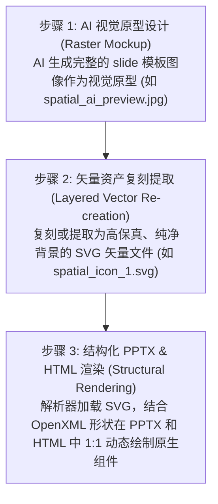

# Markdown to PPTX

## ⚠️ INITIALIZATION TRIGGER (Action Required on Invocation)

Whenever you are asked to generate a PPTX from Markdown using this skill, you **MUST** immediately use your `ask_question` tool to gather the user's preferences on three dimensions before you do any work. 

Create a multi-question interactive modal with the following choices:

**Question 1: Presentation Engine**
- Option A: (Recommended) JS Web Engine - Dynamically scales font sizes based on text volume to prevent overflow. Supports themes and interactive switcher.
- Option B: Python Engine - Relies on PPT autofit, best used if you have a strict custom corporate template.

**Question 2: Content Richness Level**
- Option A: Medium (Standard) - High-level overview, workflow, and final results.
- Option B: High (Paper Reading) - Deep dive, includes detailed architectural choices, loss functions, and ablation data.

**Question 3: Presentation Theme/Style (Only applicable to JS Web Engine)**
- Option A: (Recommended) All Themes - Generates all 6 themes with an interactive switcher HTML preview.
- Option B: Minimalist Light - Clean light theme with corporate blue accents.
- Option C: Cyber Dark - Tech-inspired dark theme with glowing neon sky-blue accents.
- Option D: Warm Editorial - Serif typography with warm sand/beige tones.
- Option E: Aurora Purple - Creative playful theme with violet and magenta accents.
- Option F: Sage Forest - Serene natural green tones for a calming corporate look.
- Option G: Deep Ocean - Trustworthy corporate deep blue theme.

*Do not proceed with generating markdown or PPTX files until the user has submitted their choices via the modal.*

Converts Markdown directly into native, editable PowerPoint (.pptx) presentations using Python.

## Core Capabilities
- **Title Slides**: Automatic detection of H1 `#` headers at the start.
- **Content Slides**: Automatic splitting of slides using horizontal rules `---`.
- **Bullet Points**: Nested bullet point lists (`- ` or `* `).
- **Speaker Notes**: Extract notes using HTML comments (`<!-- notes: ... -->`).
- **Image Insertion**: Parses Markdown image syntax (``).
- **Templating**: Automatically inherits styles, fonts, and master layouts from an optional template `.pptx` file.

## Usage

You have two engine options depending on your layout precision needs.

### Option 1: Python Engine (Template-driven)
Best for strict adherence to corporate slide masters and standard text sizes.
```bash
python3 /mnt/c/Users/Administrator/.gemini/skills/markdown-to-pptx/scripts/md2pptx.py input.md -o output.pptx
```
With a custom corporate template:
```bash
python3 /mnt/c/Users/Administrator/.gemini/skills/markdown-to-pptx/scripts/md2pptx.py input.md -t corporate_template.pptx -o output.pptx
```
*(Requires `python-pptx`)*

### Option 2: JS Web Engine (Dynamic Font Scaling)
Best for high-density content where you want the script to calculate and dynamically shrink/grow text boundaries based on the presence of images to prevent overflow.
```bash
node /mnt/c/Users/Administrator/.gemini/skills/markdown-to-pptx/scripts/md2pptx_web.js input.md -o output.pptx -t <theme>
```
Where `<theme>` is one of: `all`, `light`, `dark`, `warm`, `aurora`, `forest`, `ocean`.
*(Requires `pptxgenjs` via Node.js)*

## AIGC Slide Generation Paradigm (基于 AI 矢量分层的幻灯片生成范式)

为了克服传统 AI 生成幻灯片时出现的“位图截图模糊、背景杂色残留、绿边溢出、无法自适应主题”等系统性问题，本 Skill 引入了全新的 **AI 矢量分层生成与 1:1 精准复刻范式**：



### 1. 核心实践原则：
* **无位图污染**：严禁在 PPT 卡片中直接贴入包含背景的截图（PNG/JPEG），这会导致背景渐变冲突与 JPEG 压缩噪点。必须使用纯净、透明的 **SVG 矢量图**。
* **高清晰度无限缩放**：采用 SVG 代码（如 `<svg viewBox="0 0 100 100">`），保证在 PPT 任意缩放或投影时边缘极致锐利，且支持在 PowerPoint 中右键转换为 Office 形状进行二次编辑。
* **分层组件化对齐**：卡片卡板使用 PPTX 原生 Shape 绘制（设置 `cardBorder` 和 `cardBg`），图标作为独立 SVG 覆盖在其上方（`sizing: { type: "contain" }`），文字使用原生文本框（Text Box）渲染，从而使整个页面完全可编辑。

---

## Workflow & Content Generation

Before generating the Markdown for the presentation, you must determine or ask the user for the **Content Richness Level** (内容丰富度尺度) needed. Do not treat all presentations equally.

### 1. Medium Richness (Standard Presentation)
- **Target Audience:** General audience, high-level overviews.
- **Content:** Focuses on core concepts, workflow, and final results.
- **Format:** Bullet points, no deep formulas. High-level architecture diagrams.

### 2. High Richness (Paper Reading / Academic Level)
- **Target Audience:** Researchers, deep-dive discussions.
- **Content:** Must include detailed technical constraints (e.g., Loss function structures), specific algorithmic components (e.g., Causal Masks, Attention Matrices), and ablation study data proving why components work.
- **Format:** Precise technical terminology. Formulas should be linearized into structured text so they render cleanly in PPTX. 

*Always adapt your markdown summarization depth based on these richness scales before running the generation engine.*

## Responsive UI Layout Component System (Design Guidelines)

To make presentations look premium like Apple Keynote or McKinsey decks rather than "cheap templates", the JS Web Engine runs a responsive component layout selector based on content structure:

| Layout Component | Markdown Trigger Condition | Layout Output Design |
| :--- | :--- | :--- |
| **Centered Breathe** (居中呼吸版式) | Small text volume (< 120 chars) and no image/no cards. | A single centered card, width 50-60%, vertical & horizontal centering, enlarged fonts (+4pt), airy spacing. |
| **Horizontal Grid Cards** (水平栅格卡片) | 2 to 4 bullet points formatted as `- **Title**: Body` or `- Title: Body`. | Horizontally aligned cards (2-4 columns) with thin borders, light card backgrounds, and accent color headers. |
| **Timeline/Sequence** (时间轴/步骤链) | 3 to 5 numbered steps (e.g. `1. **Step**: Description` or titles containing step indicators/dates). | A horizontal dashed timeline with accent color nodes, step numbers above, and column cards below. |
| **Asymmetric Split** (非对称双卡片) | Text content + an image. | Left text card (accent header), right vertically-centered image card. If the image is flat/wide, alt text `` renders as a caption card underneath. |

### Design Tokens (Industrial Refinement)
*   **Background De-noising**: Never use pure white backgrounds. The engine defaults to `#F8FAFC` or `#F4F6F8` (micro-cold-gray) to let white cards stand out with subtle elevation (shadows/borders).
*   **Text Softening**: Avoid pure black (`#000`), using graphite slate (`#1E293B` or `#334155`) for titles and body.
*   **Font Step Rigidness**: Title (28pt) -> Subtitle/CardHeader (16pt, Semi-Bold) -> Body (12-13pt, Regular). 

---

## Engineering Guidelines & Lessons Learned (CRITICAL)

When modifying the `md2pptx.py` script or building custom layouts, strictly adhere to these rules discovered through iterative debugging:

1. **Never Hardcode Body Font Properties**: Explicitly setting `run.font.size`, `run.font.name`, or `paragraph.line_spacing` for standard body text will **break PowerPoint's native `MSO_AUTO_SIZE.TEXT_TO_FIT_SHAPE` feature**. It also strips away the native bullet point styles (like dots or dashes) inherited from the Slide Master. Let the PPTX master template handle base typography and auto-scaling. Only apply run-level styling for explicit inline formatting (like `run.font.bold = True`).
2. **Safe Image Margins**: When implementing two-column mixed layouts (text + image), never allocate 100% of the slide width. Always leave a minimum 5% margin on the outer edges and a 5% gap between columns to prevent wide images from bleeding off the slide (e.g., Text: 40%, Gap: 5%, Image: 50%, Right Margin: 5%).
3. **Default to 16:9 Aspect Ratio**: If no user template is provided, the script should automatically instantiate a 16:9 widescreen format (`slide_width = Inches(13.333)`, `slide_height = Inches(7.5)`). The `python-pptx` default 4:3 format looks severely outdated.

---

## Markdown Syntax Guidelines

To ensure perfect mapping to PowerPoint layouts, use the following conventions in the Markdown file:

```markdown
# Presentation Title
Subtitle line 1
Subtitle line 2

---

## Centered Breathe Example
This is a single central idea or quote. Because it has very few characters, it triggers the Centered Breathe layout automatically with large text and wide padding.

---

## 3-Column Grid Cards Layout
- **多任务超越**: 在 12 项空间几何测试中超越人类专家。
- **3D 涌现**: 无需 3D 标签，自动生成一致的立体结构。
- **零样本迁移**: 直接适配未见过的建筑仿真环境。

---

## Timeline Step Layout
1. **模型定义**: 定义 4D 空间寄存器标记及位置编码。
2. **时空交互**: 寄存器标记在自注意力机制中融合上下文信息。
3. **解码重建**: 解码并投影回 3D 空间，输出 4D 世界动作状态。

---

## Asymmetric Image Layout
- **双通道融合**: 文字放置在左侧卡片，右侧自适应居中对齐模型结构图。
- **动态重心补偿**: 如果结构图高度较矮，下方将渲染图注卡片。


```